# 🧪 LAB 01 — Azure Environment & Resource Management

> **40-Lab Azure Cloud Engineering • Architecture • DevOps Program**

**Certification Alignment:** AZ-900  
**Primary Skill:** Azure Resource Management  
**Difficulty:** 🟢 Beginner → 🟡 Foundation  
**Duration:** 90–120 minutes  
**Mode:** Live Instructor-Led + Hands-On  
**Tools:** Azure Portal • Azure Cloud Shell • Azure CLI • VS Code • GitHub Copilot / GitHub Copilot for Azure  
**Portfolio Output:** Azure environment design + CLI evidence + Bicep + troubleshooting report

---

# 🎯 Lab Mission

This lab establishes the foundation for every later Azure lab.

You will:

```text
UNDERSTAND
    ↓
DESIGN
    ↓
CREATE
    ↓
MANAGE
    ↓
AUTOMATE
    ↓
VALIDATE
    ↓
TROUBLESHOOT
    ↓
DOCUMENT
```

You will perform the same basic task through multiple interfaces:

```text
Azure Portal
     │
     ├──────────────┐
     ▼              ▼
Azure CLI       Bicep / IaC
     │              │
     └──────┬───────┘
            ▼
      Azure Resource Manager
            │
            ▼
      Azure Resources
```

You will also use **GitHub Copilot** as an AI engineering assistant — but you will learn to **review, validate and understand AI-generated commands/code rather than blindly executing them**.

GitHub Copilot for Azure can help users learn Azure services, deploy resources, inspect resources, troubleshoot Azure resources and generate/edit Bicep. citeturn0search9turn0search7

---

# 🏢 REAL-WORLD SCENARIO

You have joined **Contoso Retail** as a Junior Azure Cloud Engineer.

Contoso is preparing to migrate its first application workload to Microsoft Azure.

The future environment will eventually contain:

```text
                         CONTOSO RETAIL
                               │
                               ▼
                       Azure Subscription
                               │
                               ▼
                       Resource Groups
                               │
                ┌──────────────┼──────────────┐
                ▼              ▼              ▼
           Development      Testing       Production
                │              │              │
                ▼              ▼              ▼
             Compute        Storage        Networking
                │              │              │
                └──────────────┼──────────────┘
                               ▼
                         Monitoring
```

For this lab, your responsibility is to establish the **development environment**.

---

# 📋 BUSINESS REQUIREMENTS

The platform team requires:

1. Development resources must be separated from production.
2. Resources must be clearly associated with an application.
3. Resources must identify their environment.
4. Resources must identify their owner.
5. A suitable Azure region must be selected.
6. Availability Zone support must be investigated.
7. A naming convention must be established.
8. A tagging strategy must be implemented.
9. The environment must be manageable through Azure Portal and CLI.
10. The environment should eventually be reproducible using Infrastructure as Code.
11. The configuration and decisions must be documented in GitHub/GitLab.
12. AI assistance may be used, but every generated command or template must be reviewed before execution.

---

# 🎯 LEARNING OBJECTIVES

By the end of this lab you should be able to:

- Explain Tenant → Subscription → Resource Group → Resource.
- Explain Azure regions and Availability Zones.
- Select an Azure region using evidence.
- Create a Resource Group through the Azure Portal.
- Create a Resource Group using Azure CLI.
- Inspect Azure resources using Azure CLI.
- Apply and query tags.
- Understand Azure Resource IDs.
- Create a Resource Group with Bicep.
- Use GitHub Copilot to explain Azure concepts.
- Use GitHub Copilot to generate and improve Azure CLI commands.
- Use GitHub Copilot for Azure to assist with Azure/Bicep tasks.
- Validate AI-generated infrastructure code.
- Troubleshoot basic Azure resource-management issues.
- Document your work in GitHub/GitLab.

---

# 🧠 PART 0 — THE AZURE RESOURCE HIERARCHY

Understand this before touching Azure:

```text
Microsoft Entra Tenant
        │
        ▼
    Subscription
        │
        ▼
   Resource Group
        │
   ┌────┼────┐
   ▼    ▼    ▼
Compute Storage Network
   │    │    │
   └────┼────┘
        ▼
     Resources
```

## Question 1

**What is an Azure subscription?**

### Instructor Answer

An Azure subscription is a management, access and billing boundary for Azure resources. Azure resources are created within subscriptions, and organizations can use multiple subscriptions to separate workloads, environments, departments, billing or governance boundaries.

---

## Question 2

**What is a Resource Group?**

### Instructor Answer

A Resource Group is a logical container for related Azure resources. It is commonly used to organize resources according to application, environment, lifecycle or ownership.

A Resource Group is not the same thing as a physical datacenter or Azure region.

---

## Question 3

**What happens when a Resource Group is deleted?**

### Instructor Answer

Deleting a Resource Group normally deletes the resources contained in that Resource Group. Therefore, students must verify what is inside a Resource Group before deleting it.

---

## Question 4

**Can a Resource Group contain resources in different Azure regions?**

### Instructor Answer

Yes. A Resource Group is a logical management container and is not itself restricted to a single Azure region. However, individual Azure resources have their own location requirements and regional behavior.

---

# 🖱️ PART 1 — AZURE PORTAL: CREATE THE ENVIRONMENT

## Step 1 — Open Azure Portal

Open:

https://portal.azure.com/

Sign in with your training Azure account.

---

## Step 2 — Find Resource Groups

In the Azure Portal search bar:

```text
Resource groups
```

Select:

**Resource groups**

Then select:

**+ Create**

---

## Step 3 — Select Subscription

Choose your training subscription.

Record:

```text
Subscription Name:
________________________

Subscription ID:
________________________
```

---

## Step 4 — Create Resource Group

Enter:

```text
Resource Group:
rg-contoso-dev
```

---

## Step 5 — Select Region

Use the region decision you made in Part 2.

---

## Step 6 — Add Tags

Configure:

| Tag | Value |
|---|---|
| Environment | Dev |
| Application | ContosoRetail |
| Owner | CloudEngineering |
| CostCenter | Training |
| ManagedBy | Student |

---

## Step 7 — Review + Create

Select:

**Review + create**

Confirm validation succeeds.

Select:

**Create**

---

# 🖱️ PORTAL VALIDATION

Open:

```text
Resource Groups
→ rg-contoso-dev
```

Verify:

- Resource Group name
- Subscription
- Region
- Tags
- Resource ID
- Deployment state

Take screenshots.

Recommended:

```text
screenshots/
├── resource-group.png
├── tags.png
└── resource-id.png
```

---

# 🌍 PART 2 — AZURE REGION DECISION

Do not simply choose a region because it is nearby.

Compare at least two regions.

Example:

```text
Region A: South India
Region B: Central India
```

Investigate:

| Decision Factor | Region A | Region B |
|---|---|---|
| Geography | | |
| Availability Zones | | |
| Required services | | |
| Latency | | |
| Data residency | | |
| Disaster recovery | | |
| Cost | | |

## Architecture Decision

Complete:

> We selected **__________** because **__________**.

### Instructor Guidance

A professional region decision should consider more than geography. Consider:

- User proximity
- Service availability
- Resiliency requirements
- Data residency
- Compliance
- Disaster recovery
- Cost
- Capacity
- Availability Zone support

Always verify current Microsoft documentation because regional capabilities change.

---

# 📊 DIAGRAMS & ARCHITECTURE VISUALIZATION

This lab deliberately uses **multiple diagram types** because cloud engineers need different diagrams for different questions.

> **GitHub/GitLab note:** Mermaid diagrams render natively in many modern GitHub/GitLab Markdown views. UML diagrams below use **Mermaid UML-style diagrams** so the lab remains a single `.md` file without requiring separate image files.

---

## 1. Mermaid — Azure Resource Hierarchy

Use this when explaining **management hierarchy**:

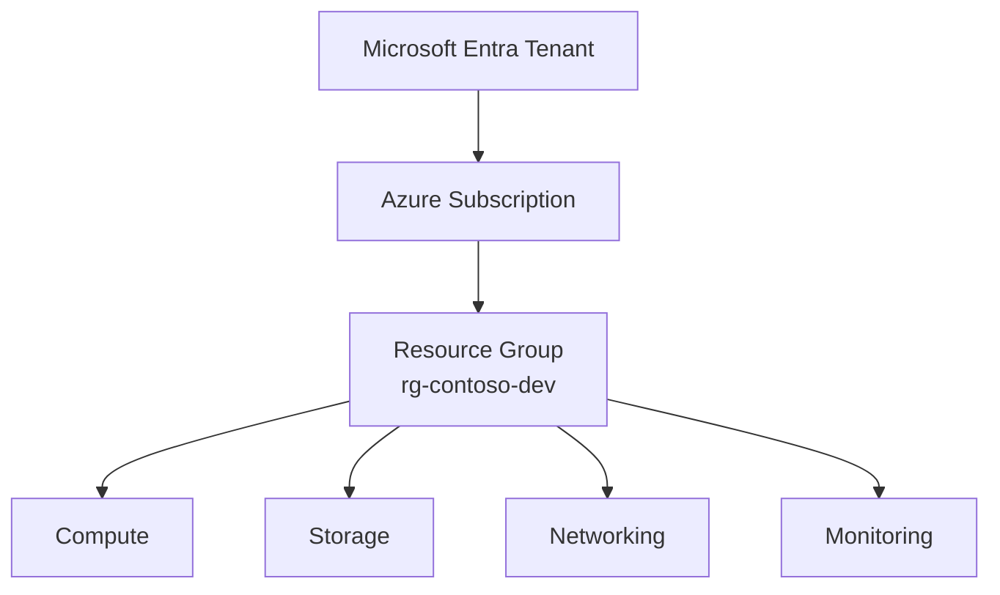

---

## 2. Mermaid — Environment Architecture

Use this when explaining **environment separation**:

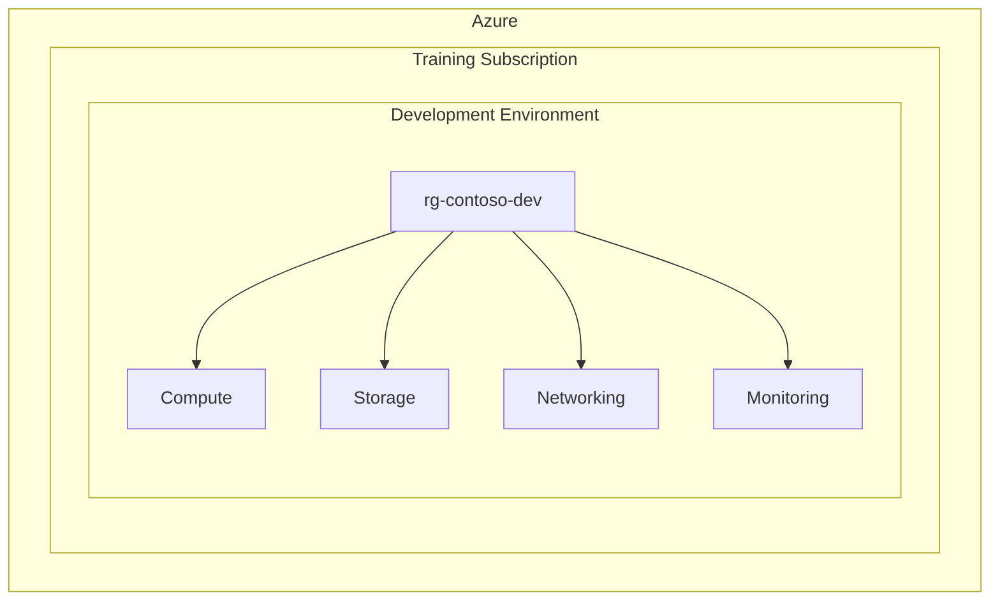

---

## 3. Mermaid — High-Level Cloud Engineering Flow

Use this when explaining the **engineering lifecycle**:

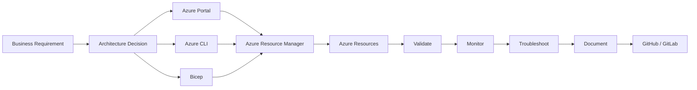

---

## 4. Mermaid — AI-Assisted Engineering Workflow

This is the **Copilot workflow** students should learn:

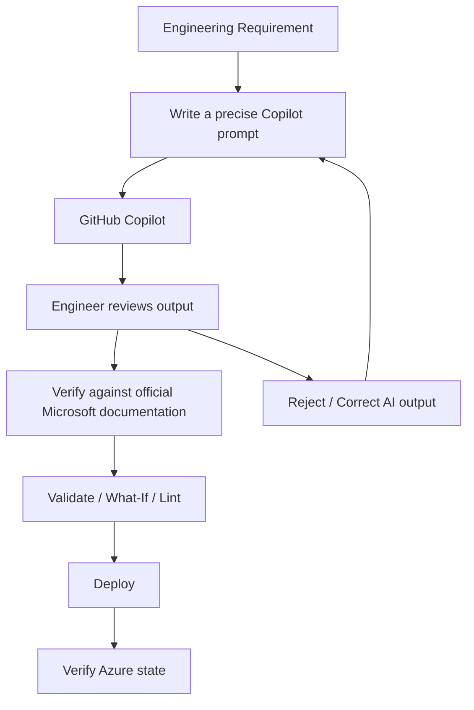

### Golden Rule

```text
COPILOT GENERATES
       ↓
ENGINEER REVIEWS
       ↓
DOCUMENTATION VALIDATION
       ↓
TEST / WHAT-IF
       ↓
DEPLOY
       ↓
VERIFY
```

---

# 📐 UML DIAGRAMS

## 5. UML-Style Component Diagram — Azure Environment

This diagram shows **logical components and relationships**, rather than the physical Azure network.

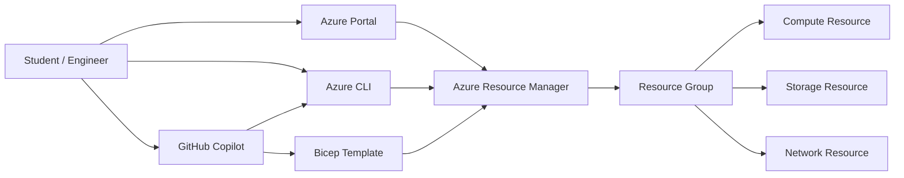

---

## 6. UML-Style Deployment Diagram

This represents the deployment relationship between the management tools and Azure.

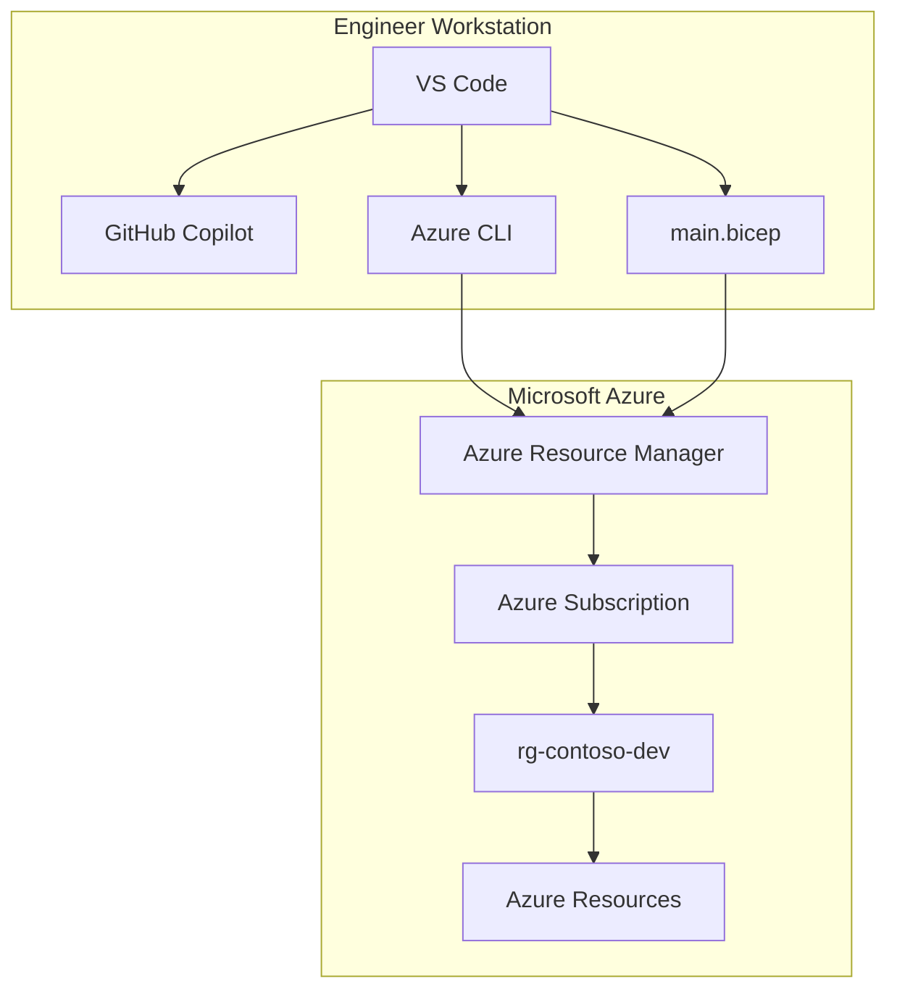

---

## 7. UML-Style Sequence Diagram — Portal Deployment

Use this when explaining **what happens behind the Portal**:

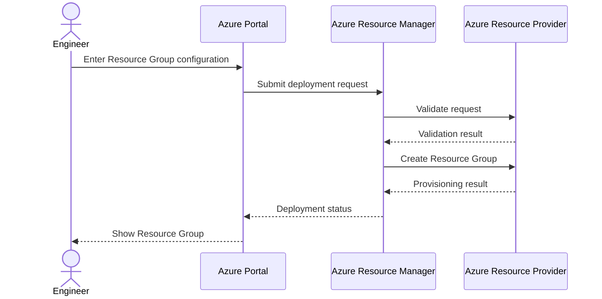

---

## 8. UML-Style Sequence Diagram — CLI + Bicep

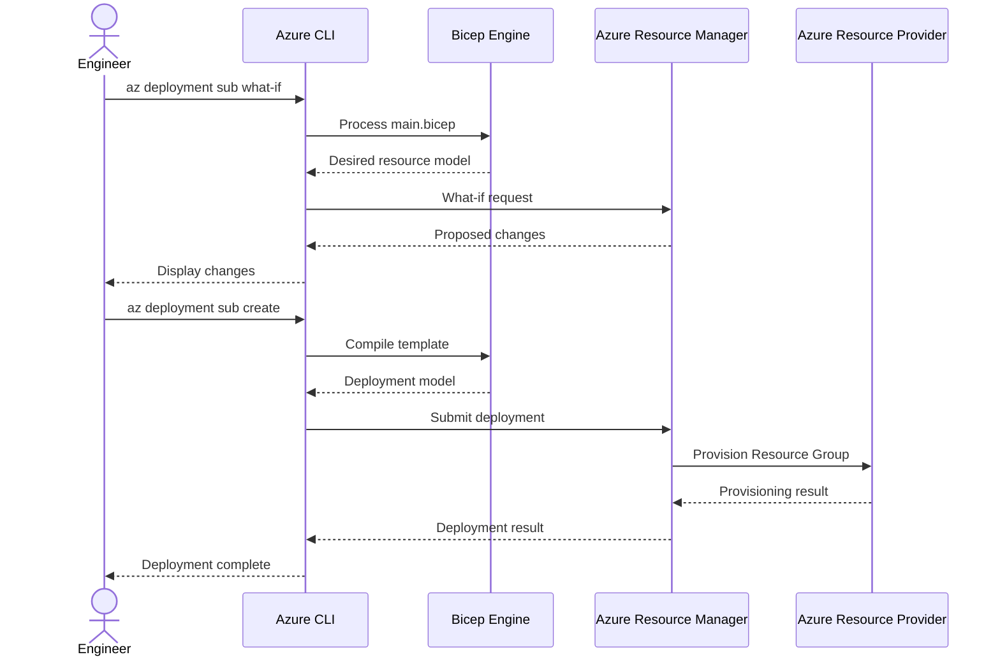

---

## 9. UML-Style State Diagram — Resource Group Lifecycle

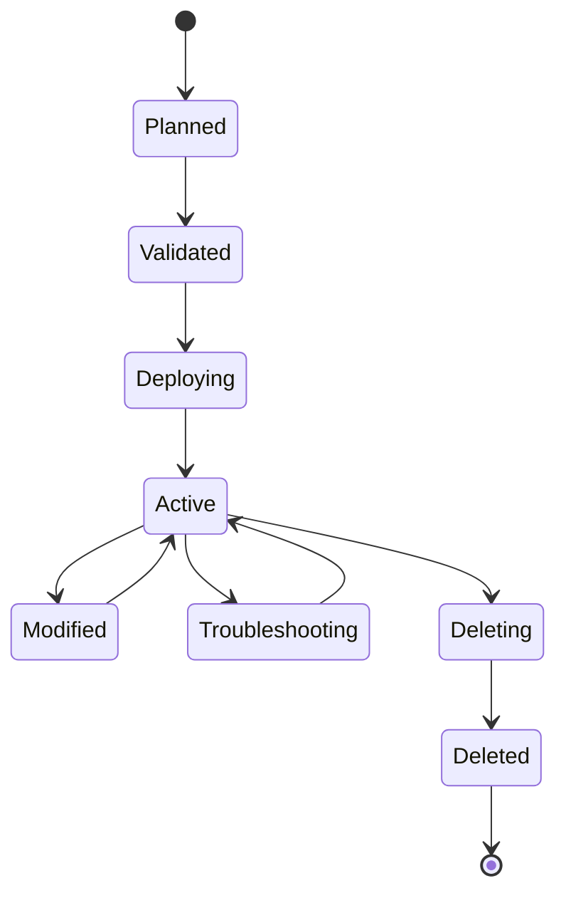

---

## 10. Mermaid Entity Relationship Diagram — Lab Portfolio

Use this to teach students how their **portfolio evidence relates to the cloud environment**:

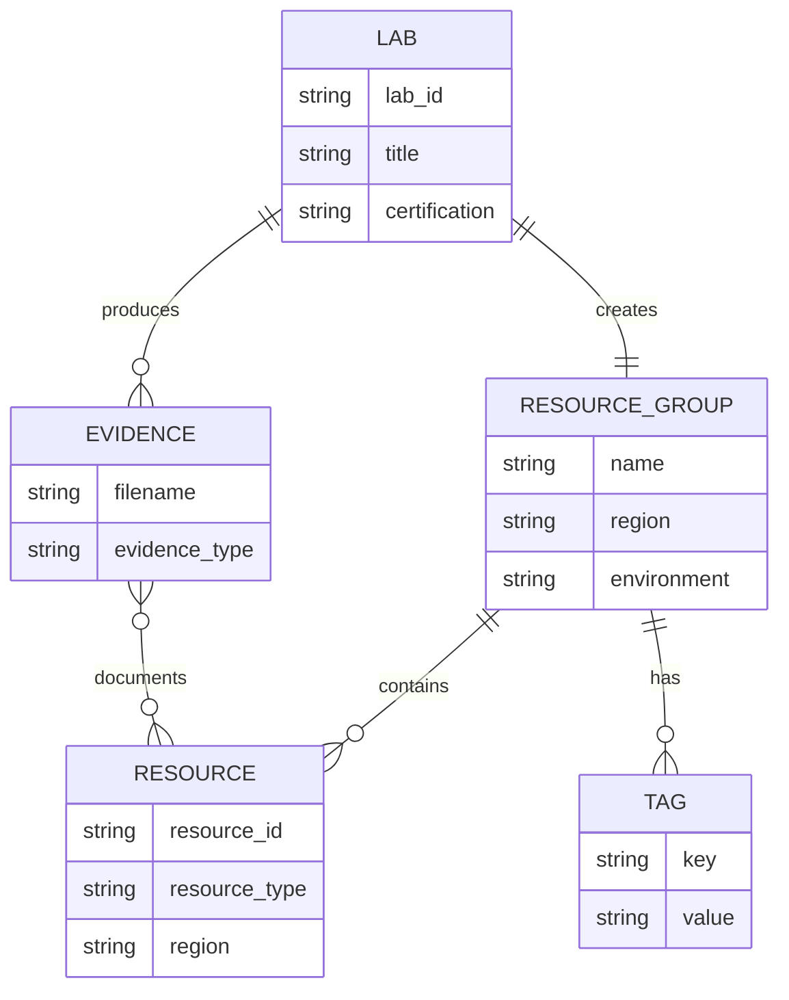

---

## 11. Mermaid Troubleshooting Decision Tree

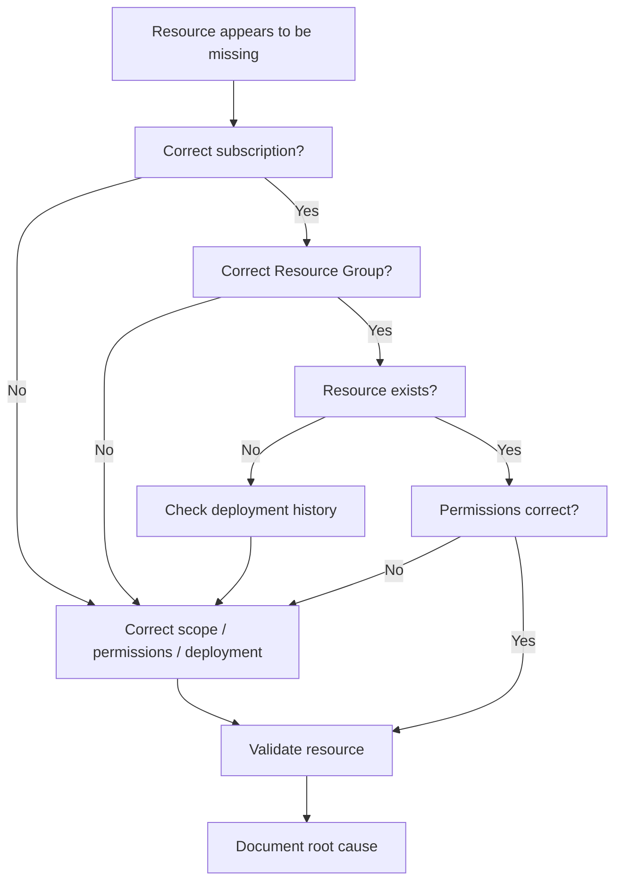

---

# 🧭 WHEN TO USE EACH DIAGRAM

| Diagram | Best Used For |
|---|---|
| Flowchart | Processes, decisions, workflows |
| Resource hierarchy | Azure management structure |
| Architecture flow | System relationships |
| Component-style diagram | Logical components |
| Deployment diagram | Where components/tools run |
| Sequence diagram | Request/deployment interactions |
| State diagram | Lifecycle and state transitions |
| ER diagram | Data/evidence relationships |
| Decision tree | Troubleshooting |

Students should **not add diagrams merely for decoration**. Every diagram should answer a specific architecture, operational or troubleshooting question.

---

# 🏢 PART 3 — AVAILABILITY ZONES

Conceptually:

```text
                    AZURE REGION
                         │
          ┌──────────────┼──────────────┐
          ▼              ▼              ▼
       Zone 1          Zone 2          Zone 3
          │              │              │
      Datacenter      Datacenter      Datacenter
```

## Question

If Zone 1 fails, does that automatically mean the application survives?

### Instructor Answer

No.

Availability Zones provide physically separated locations within an Azure region, but the application must actually be designed and deployed to use the available resilience capabilities. A single-instance workload located in one zone may still be unavailable.

This becomes a major AZ-305 architecture topic.

---

# 💻 PART 4 — AZURE CLI

Now perform the same environment management tasks using Azure CLI.

Azure CLI can be used from Azure Cloud Shell or from a local terminal.

---

## Step 1 — Login

```bash
az login
```

If you are using Azure Cloud Shell, authentication is generally already available.

---

## Step 2 — Inspect Your Account

```bash
az account show
```

Identify:

```text
id
name
tenantId
user
```

---

## Step 3 — List Subscriptions

```bash
az account list --output table
```

---

## Step 4 — Select Your Training Subscription

```bash
az account set --subscription "<SUBSCRIPTION_NAME_OR_ID>"
```

Verify:

```bash
az account show --output table
```

---

## Step 5 — Create Resource Group

```bash
az group create \
  --name rg-contoso-dev \
  --location <REGION> \
  --tags \
    Environment=Dev \
    Application=ContosoRetail \
    Owner=CloudEngineering \
    CostCenter=Training \
    ManagedBy=Student
```

Replace:

```text
<REGION>
```

with your selected Azure region.

---

## Step 6 — Verify Resource Group

```bash
az group show \
  --name rg-contoso-dev \
  --output json
```

---

## Step 7 — Show Only Important Properties

```bash
az group show \
  --name rg-contoso-dev \
  --query "{name:name,location:location,id:id,tags:tags}" \
  --output json
```

---

## Step 8 — List Resource Groups

```bash
az group list --output table
```

---

## Step 9 — Query Tags

```bash
az group show \
  --name rg-contoso-dev \
  --query tags \
  --output json
```

---

## Step 10 — Verify Existence

```bash
az group exists \
  --name rg-contoso-dev
```

Expected:

```text
true
```

---

# 🧠 CLI QUESTIONS

## Question

Why would an enterprise engineer use Azure CLI if the Azure Portal already exists?

### Instructor Answer

CLI enables repeatable, scriptable and automatable operations. It is particularly useful for automation, troubleshooting, bulk operations, CI/CD and Infrastructure as Code workflows.

---

## Question

Should engineers memorize every Azure CLI command?

### Instructor Answer

No.

They should understand the Azure resource model, know how to find authoritative documentation, understand command structure, validate generated commands and be able to troubleshoot when commands fail.

This is one reason AI assistants such as GitHub Copilot can be useful.

---

# 🤖 PART 5 — GITHUB COPILOT AS YOUR CLOUD ENGINEERING ASSISTANT

This lab introduces AI-assisted cloud engineering.

The goal is **not**:

> "Let Copilot do the lab."

The goal is:

> **"Use Copilot to accelerate engineering work while you remain responsible for the design, security, correctness and validation."**

GitHub Copilot CLI can operate directly in the terminal, answer questions, write/debug code and interact with GitHub workflows. citeturn0search0turn0search1

GitHub Copilot for Azure can assist with Azure learning, resource deployment, resource information and troubleshooting, and Microsoft documents Bicep generation/editing with it. citeturn0search9turn0search7

---

# 🧰 PART 5A — COPILOT SETUP

Students may use:

- GitHub Copilot in VS Code
- GitHub Copilot for Azure
- GitHub Copilot CLI

GitHub's current Copilot CLI documentation lists installation options for npm, WinGet and Homebrew. citeturn0search0

For the course, the recommended experience is:

```text
VS Code
   +
Azure Tools
   +
GitHub Copilot
   +
GitHub Copilot for Azure
   +
Azure CLI
   +
Bicep
```

Microsoft also documents VS Code for the Web with Azure tools and GitHub Copilot for Azure, which can be useful when students do not have a local development environment. citeturn0search5

---

# 🤖 PART 5B — COPILOT EXERCISE: EXPLAIN AZURE

Ask Copilot:

```text
Explain the difference between an Azure tenant,
subscription, resource group and resource.

Use a real-world enterprise example and explain
which boundary is commonly used for billing,
organization and resource lifecycle.
```

### Student Task

Do not copy the response blindly.

Compare it against Microsoft documentation.

Write:

```text
What Copilot explained correctly:
____________________________________

What I verified:
____________________________________

What I learned:
____________________________________
```

---

# 🤖 PART 5C — COPILOT EXERCISE: GENERATE AZURE CLI

Ask Copilot:

```text
Generate an Azure CLI command to create a Resource Group
named rg-contoso-dev in <REGION> with these tags:

Environment=Dev
Application=ContosoRetail
Owner=CloudEngineering
CostCenter=Training
ManagedBy=Student

Explain every argument before I execute it.
```

### Student Rule

Do **not** execute immediately.

First inspect:

```text
az group create
--name
--location
--tags
```

Then compare the generated command with Microsoft's Azure CLI documentation.

---

# 🤖 PART 5D — COPILOT CHALLENGE: REVIEW A COMMAND

Give Copilot this command:

```bash
az group create \
  --name rg-contoso-dev \
  --location <REGION> \
  --tags Environment=Dev Application=ContosoRetail
```

Ask:

```text
Review this Azure CLI command.

Explain:
1. What it does.
2. What resources it creates.
3. What it does not create.
4. Potential risks.
5. How to verify the result.
6. How to delete the Resource Group safely.
```

### Instructor Answer

The command creates a Resource Group. It does not create a VM, VNet, Storage Account or application workload.

It creates the logical management container and applies the specified tags.

---

# 🤖 PART 5E — GITHUB COPILOT CLI

If GitHub Copilot CLI is available, open a terminal in the lab repository and run:

```bash
copilot
```

GitHub's current documentation says the first interactive session requires authentication and a trust confirmation for the working directory. citeturn0search0

Ask:

```text
Explain the Azure environment created in this repository.

Identify:
- Azure subscription assumptions
- Resource Groups
- Azure CLI commands
- Bicep files
- Naming conventions
- Potential security issues
- Cleanup commands
```

You can also use a one-shot prompt:

```bash
copilot -p "Explain the purpose of this Azure lab repository."
```

GitHub documents the `-p` option for prompt-based Copilot CLI usage. citeturn0search0turn0search11

---

# ⚠️ COPILOT SAFETY RULE

Students must follow:

```text
AI GENERATES
     ↓
STUDENT REVIEWS
     ↓
STUDENT VALIDATES
     ↓
STUDENT EXECUTES
     ↓
STUDENT VERIFIES
```

Never:

```text
AI GENERATES
     ↓
BLINDLY EXECUTE
```

Especially do not blindly execute:

```bash
az group delete
az resource delete
az role assignment create
az role assignment delete
az vm delete
```

or commands that modify production resources.

---

# 🧱 PART 6 — BICEP / INFRASTRUCTURE AS CODE

Now we introduce Infrastructure as Code.

Bicep is Microsoft's declarative language for deploying Azure resources and integrates with Azure Resource Manager. citeturn0search10

Create:

```text
infra/
└── main.bicep
```

Because a Resource Group is itself a subscription-level resource-management construct, use a subscription-scoped Bicep file.

---

## `main.bicep`

```bicep
targetScope = 'subscription'

@description('Azure region for the Resource Group')
param location string

@description('Name of the development Resource Group')
param resourceGroupName string = 'rg-contoso-dev'

resource rg 'Microsoft.Resources/resourceGroups@2025-04-01' = {
  name: resourceGroupName
  location: location
  tags: {
    Environment: 'Dev'
    Application: 'ContosoRetail'
    Owner: 'CloudEngineering'
    CostCenter: 'Training'
    ManagedBy: 'Student'
  }
}
```

> **Version note:** Azure resource API versions change over time. If your environment recommends a newer stable Resource Group API version, use the current Microsoft documentation.

---

# 🧱 BICEP VALIDATION

Check Bicep:

```bash
az bicep version
```

If required:

```bash
az bicep install
```

Build the file:

```bash
az bicep build \
  --file infra/main.bicep
```

---

# 🧪 BICEP WHAT-IF

Before deployment, use:

```bash
az deployment sub what-if \
  --location <REGION> \
  --template-file infra/main.bicep \
  --parameters location=<REGION>
```

### Why What-If?

It allows you to inspect the expected deployment changes before actually applying them.

---

# 🚀 BICEP DEPLOYMENT

Deploy:

```bash
az deployment sub create \
  --location <REGION> \
  --template-file infra/main.bicep \
  --parameters location=<REGION>
```

Then verify:

```bash
az group show \
  --name rg-contoso-dev \
  --output table
```

---

# 🤖 PART 7 — USE COPILOT TO GENERATE BICEP

Ask GitHub Copilot:

```text
Create a subscription-scope Bicep file that creates
an Azure Resource Group named rg-contoso-dev.

Use a location parameter.

Add these tags:

Environment=Dev
Application=ContosoRetail
Owner=CloudEngineering
CostCenter=Training
ManagedBy=Student

Explain the targetScope, resource declaration,
parameters and tags.

Do not include any resources other than the Resource Group.
```

Then compare Copilot's version with your manually written version.

## Student Task

Document:

```text
Copilot generated:
________________________

I changed:
________________________

Why:
________________________
```

---

# 🤖 PART 8 — COPILOT FOR AZURE CHALLENGE

If GitHub Copilot for Azure is installed, ask:

```text
I am building a development environment for a retail
application in Azure.

Help me determine:
1. Which Azure region I should evaluate.
2. Whether the region supports Availability Zones.
3. Which Azure services I should verify for future labs.
4. What governance considerations I should document.

Do not deploy anything.
Give me an investigation checklist.
```

The important instruction is:

> **Do not deploy anything.**

For this lab, Copilot is being used as a **research and reasoning assistant**, not an autonomous deployment engine.

Microsoft documents GitHub Copilot for Azure use cases including learning about Azure, designing/developing applications, deploying applications and troubleshooting Azure resources. citeturn0search3

---

# 🧠 PART 9 — AI OUTPUT REVIEW EXERCISE

This is an important professional skill.

Ask Copilot to produce:

```text
A production-ready Azure Resource Group naming standard.
```

Then review the response.

Create:

```text
decisions/
└── copilot-review.md
```

Document:

```markdown
# Copilot Review

## Prompt

[Prompt used]

## Copilot Recommendation

[Summary]

## What I Accepted

[Items accepted]

## What I Rejected

[Items rejected]

## Microsoft Documentation Used

[Official references]

## Final Decision

[Your engineering decision]
```

---

# 🚨 PART 10 — TROUBLESHOOTING INCIDENT

## Incident

A developer reports:

> "The Resource Group exists, but I can't find the resources I created yesterday."

You are given:

```text
Subscription:
Training Subscription

Resource Group:
rg-contoso-dev

Region:
Your selected region
```

---

## Investigation 1 — Verify Subscription

```bash
az account show --output table
```

### Question

Why is this the first thing to check?

### Instructor Answer

Azure Portal and CLI can operate against different subscriptions. If the engineer is looking at the wrong subscription, resources may appear to be missing even though they exist.

---

## Investigation 2 — Verify Resource Group

```bash
az group exists \
  --name rg-contoso-dev
```

Expected:

```text
true
```

---

## Investigation 3 — List Resources

```bash
az resource list \
  --resource-group rg-contoso-dev \
  --output table
```

---

## Investigation 4 — Check Resource Group Details

```bash
az group show \
  --name rg-contoso-dev \
  --output json
```

---

## Investigation 5 — Ask Copilot

Give Copilot the non-sensitive error information:

```text
A developer says Azure resources are missing.

The Resource Group exists.

The subscription is confirmed.

The Resource Group is:
rg-contoso-dev

What are the most likely causes?

Give me a troubleshooting decision tree.
Do not make any changes.
```

### Student Task

Compare Copilot's troubleshooting tree with your own.

Do not provide:

- Passwords
- Secrets
- Access tokens
- Connection strings
- Private keys
- Sensitive customer information

---

# 🧠 TROUBLESHOOTING DECISION TREE

```text
Resources Missing
       │
       ▼
Correct Subscription?
   │          │
  NO         YES
   │          │
Switch       ▼
         Correct RG?
           │     │
          NO    YES
           │     │
       Find RG    ▼
              Resource Exists?
                │      │
               NO     YES
                │       │
        Investigate   Check
        deployment    permissions
        history
```

---

# 🔥 PART 11 — REAL-WORLD ENGINEERING CHALLENGE

Your manager now says:

> "Create a second Resource Group for our analytics development workload."

You must decide:

```text
Name:
______________________

Region:
______________________

Tags:
______________________

Reason for separate Resource Group:
______________________
```

Then implement it using:

### Portal

```text
Resource Groups
→ Create
→ Configure
→ Tags
→ Review + Create
```

### CLI

Write the command yourself.

### Bicep

Modify your Bicep template to support a different Resource Group name.

### Copilot

Ask Copilot:

```text
Review my Resource Group design.

Do not modify anything.

Identify:
- Naming issues
- Tagging issues
- Environment separation issues
- Automation opportunities
- Governance considerations
```

---

# 🧪 PART 12 — ACCEPTANCE CRITERIA

You have completed Lab 01 when you can demonstrate:

- [ ] Azure subscription identified.
- [ ] Tenant/subscription/resource-group/resource hierarchy explained.
- [ ] Two regions compared.
- [ ] Availability Zones investigated.
- [ ] Primary region selected with documented reasoning.
- [ ] `rg-contoso-dev` created through Azure Portal.
- [ ] Required tags applied.
- [ ] Resource Group inspected in Portal.
- [ ] Resource Group created/managed with Azure CLI.
- [ ] Resource Group queried using Azure CLI.
- [ ] Resource ID identified.
- [ ] Bicep template created.
- [ ] Bicep validated.
- [ ] Bicep what-if performed.
- [ ] Bicep deployment performed.
- [ ] GitHub Copilot used to explain Azure concepts.
- [ ] GitHub Copilot used to generate/review CLI.
- [ ] GitHub Copilot used to assist with Bicep.
- [ ] AI-generated output was reviewed against authoritative documentation.
- [ ] Troubleshooting scenario completed.
- [ ] Portfolio evidence committed to GitHub/GitLab.
- [ ] Resources cleaned up.

---

# 🖼️ PART 12A — DIAGRAM REQUIREMENTS

For this lab, commit at least **three diagrams** to your repository:

1. **Azure Resource Hierarchy**
2. **Environment Architecture**
3. **AI-Assisted Engineering Workflow**

Recommended additional diagrams:

```text
architecture/
├── azure-resource-hierarchy.md
├── environment-architecture.md
├── copilot-engineering-flow.md
├── deployment-sequence.md
└── troubleshooting-flow.md
```

Your README should contain at least one embedded Mermaid architecture diagram.

Example:

```markdown
## Architecture

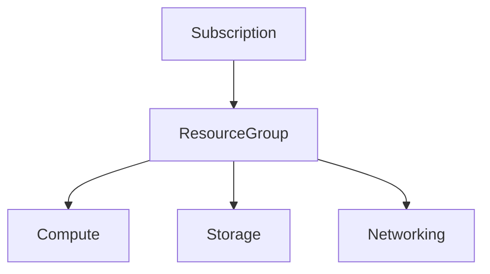
```

> Keep diagrams version-controlled alongside the infrastructure code. This creates a portfolio that demonstrates both **implementation and architectural communication**.

---

# 📦 PART 13 — GITHUB / GITLAB DELIVERABLE

Recommended repository:

```text
azure-cloud-engineering/
└── 01-azure-environment-resource-management/
    │
    ├── README.md
    │
    ├── architecture/
    │   └── azure-environment.md
    │
    ├── decisions/
    │   ├── region-selection.md
    │   └── copilot-review.md
    │
    ├── infra/
    │   └── main.bicep
    │
    ├── screenshots/
    │   ├── resource-group.png
    │   ├── tags.png
    │   ├── cloud-shell.png
    │   └── bicep-deployment.png
    │
    └── troubleshooting/
        └── incident-01.md
```

---

# 💼 PART 14 — RESUME OUTCOME

Possible project statement:

> **Designed and configured an Azure development environment using Azure Resource Manager, Resource Groups, region and Availability Zone analysis, resource naming standards and tagging strategy; implemented and validated the environment through Azure Portal, Azure CLI and Bicep.**

AI-assisted engineering statement:

> **Used GitHub Copilot to accelerate Azure CLI and Bicep development while validating generated infrastructure code against Microsoft Azure documentation and deployment results.**

---

# 🧑‍💻 PART 15 — PORTFOLIO SKILLS DEMONSTRATED

Your GitHub/GitLab repository should demonstrate:

```text
Azure Resource Management
        │
        ├── Azure Portal
        ├── Azure CLI
        ├── Bicep
        ├── Resource Naming
        ├── Resource Tagging
        ├── Region Selection
        ├── Availability Zones
        ├── Troubleshooting
        ├── Documentation
        └── AI-Assisted Engineering
```

---

# 🎤 PART 16 — INTERVIEW QUESTIONS + ANSWERS

## 1. What is an Azure Resource Group?

**Answer:**

A Resource Group is a logical container for related Azure resources. It can help organize resources by application, environment, ownership or lifecycle.

---

## 2. What is an Azure subscription?

**Answer:**

An Azure subscription is a management and billing boundary that contains Azure resources. Organizations can use multiple subscriptions to separate environments, departments, billing or governance boundaries.

---

## 3. What is the difference between a Region and an Availability Zone?

**Answer:**

A region is a geographic Azure location containing one or more datacenters. Availability Zones are physically separated datacenter groupings within certain Azure regions designed to improve resilience against datacenter-level failures.

---

## 4. Why use Resource Groups?

**Answer:**

Resource Groups provide a logical way to organize related resources and can align resources with application boundaries, environments and lifecycle management.

---

## 5. Why use tags?

**Answer:**

Tags provide metadata that can help identify ownership, environment, application, cost center and other organizational information.

---

## 6. Should production and development resources share a Resource Group?

**Answer:**

Usually they should be separated when their lifecycle, access requirements, governance or operational boundaries differ. The exact structure depends on the organization's architecture and governance model.

---

## 7. Why use Azure CLI?

**Answer:**

Azure CLI enables repeatable and scriptable resource-management operations and is useful for automation, troubleshooting, CI/CD and Infrastructure as Code workflows.

---

## 8. Why use Bicep if Azure CLI can create resources?

**Answer:**

CLI commands are generally imperative instructions. Bicep provides a declarative Infrastructure as Code approach that describes the desired Azure configuration and can be version-controlled, reviewed and repeatedly deployed.

---

## 9. Is GitHub Copilot a replacement for an Azure engineer?

**Answer:**

No. Copilot can accelerate research, coding, infrastructure authoring and troubleshooting, but the engineer remains responsible for architecture, security, validation, cost and operational decisions.

---

## 10. What should you do before executing AI-generated Azure commands?

**Answer:**

Review the command, understand its impact, compare it with authoritative documentation, verify the target subscription/resource scope, inspect potentially destructive operations and validate the result after execution.

---

# 🧠 PART 17 — ARCHITECTURE QUESTIONS + ANSWERS

## Scenario 1

> Your company has Development, Test and Production environments. How would you organize them?

### Suggested Answer

A common starting point is to separate environments using Resource Groups and/or subscriptions depending on security, governance, billing and operational requirements. Larger enterprises may use Management Groups above subscriptions to apply governance consistently.

---

## Scenario 2

> Your production application requires high availability. Is deploying to an Azure region enough?

### Suggested Answer

Not necessarily. High availability depends on the application's architecture and the resilience capabilities of the services used. Availability Zones may be appropriate for zone-resilient architectures, while multi-region designs may be required for broader regional disaster scenarios.

---

## Scenario 3

> Your company has 100 Azure subscriptions. How do you manage governance?

### Suggested Answer

A large organization can use Management Groups, Azure Policy, role-based access control, standardized naming/tagging and centralized governance patterns to manage subscriptions at scale.

---

# 🤖 PART 18 — AI ENGINEERING INTERVIEW QUESTIONS

## Question 1

> How have you used GitHub Copilot in Azure projects?

### Strong Answer

> I use GitHub Copilot as an engineering assistant rather than an authority. For example, I use it to explain Azure concepts, generate or improve Azure CLI commands, assist with Bicep templates and analyze troubleshooting scenarios. I then validate the generated output against Microsoft documentation, inspect the target scope and test the deployment before accepting it.

---

## Question 2

> What is the risk of using AI-generated Infrastructure as Code?

### Strong Answer

> AI-generated infrastructure can contain incorrect resource properties, outdated API versions, security weaknesses, excessive permissions or unintended resources. Therefore I treat AI output as a draft, review it, validate it with tooling such as Bicep build and what-if, compare it against authoritative documentation and then deploy it.

---

# 🏆 PART 19 — ADVANCED CHALLENGE

Design the following:

```text
                    CONTOSO RETAIL
                           │
                           ▼
                    Management Group
                           │
             ┌─────────────┼─────────────┐
             ▼             ▼             ▼
          Platform      Non-Prod       Prod
          Subscription Subscription  Subscription
             │             │             │
             ▼             ▼             ▼
          Resource       Resource      Resource
           Groups         Groups        Groups
```

Answer:

1. Which governance controls belong at Management Group level?
2. Which belong at Subscription level?
3. Which belong at Resource Group level?
4. Where would you apply Azure Policy?
5. Where would you apply RBAC?
6. Where would tags be useful?
7. Which parts would you automate with Bicep?
8. Where could GitHub Copilot help?
9. Which actions should require human approval?

### Suggested Solution Direction

Students should identify:

```text
Management Group
    ↓
Organization-wide governance

Subscription
    ↓
Billing / access / workload boundary

Resource Group
    ↓
Application / environment / lifecycle boundary

Resources
    ↓
Individual Azure services
```

There is not necessarily one universally correct enterprise design. The student should justify the design based on security, governance, lifecycle, billing and operational requirements.

---

# 💰 PART 20 — COST CONTROL

This lab intentionally avoids expensive resources.

The core lab requires:

- Resource Group
- Azure Portal
- Cloud Shell
- Azure CLI
- Bicep
- GitHub Copilot assistance
- Region/Availability Zone research

No VM is required for the core exercise.

If an instructor introduces billable resources, students must be given explicit cost guidance and cleanup instructions.

---

# 🧹 PART 21 — CLEANUP

Before deleting anything, inspect the Resource Group:

```bash
az resource list \
  --resource-group rg-contoso-dev \
  --output table
```

Then delete:

```bash
az group delete \
  --name rg-contoso-dev \
  --yes \
  --no-wait
```

Verify:

```bash
az group exists \
  --name rg-contoso-dev
```

Expected:

```text
false
```

> ⚠️ Never execute deletion commands against a production Resource Group without confirming scope and authorization.

---

# 📚 OFFICIAL REFERENCES

## Microsoft Azure

- Azure Resource Manager  
  https://learn.microsoft.com/en-us/azure/azure-resource-manager/management/overview

- Azure Regions  
  https://learn.microsoft.com/en-us/azure/reliability/regions-list

- Azure Availability Zones  
  https://learn.microsoft.com/en-us/azure/reliability/availability-zones-overview

- Azure Resource Tagging  
  https://learn.microsoft.com/en-us/azure/azure-resource-manager/management/tag-resources

- Azure CLI  
  https://learn.microsoft.com/en-us/cli/azure/

- Bicep  
  https://learn.microsoft.com/en-us/azure/azure-resource-manager/bicep/

- Azure Developer Tools  
  https://learn.microsoft.com/en-us/azure/developer/intro/quickstart-developer-tools

## GitHub Copilot

- GitHub Copilot CLI  
  https://docs.github.com/en/copilot/get-started/cli-quickstart

- GitHub Copilot CLI Usage  
  https://docs.github.com/en/copilot/how-tos/copilot-cli/use-copilot-cli

- GitHub Copilot for Azure  
  https://learn.microsoft.com/en-us/azure/developer/github-copilot-azure/

- GitHub Copilot for Azure — Bicep  
  https://learn.microsoft.com/en-us/azure/developer/github-copilot-azure/bicep-generate-edit

---

# 🏁 LAB COMPLETION CHECKLIST

```text
AZURE FUNDAMENTALS
[ ] Tenant understood
[ ] Subscription understood
[ ] Resource Group understood
[ ] Resource understood
[ ] Region understood
[ ] Availability Zones understood

PORTAL
[ ] Resource Group created
[ ] Tags configured
[ ] Resource ID located
[ ] Screenshots captured

CLI
[ ] az login
[ ] az account show
[ ] az account set
[ ] az group create
[ ] az group show
[ ] az resource list
[ ] az group exists

BICEP
[ ] main.bicep created
[ ] Bicep validated
[ ] What-if performed
[ ] Deployment performed
[ ] Deployment verified

GITHUB COPILOT
[ ] Azure concepts explained
[ ] CLI command generated/reviewed
[ ] Bicep generated/reviewed
[ ] Troubleshooting assistance used
[ ] AI output validated

PORTFOLIO
[ ] README completed
[ ] Architecture documented
[ ] Region decision documented
[ ] Copilot review documented
[ ] Screenshots committed
[ ] Bicep committed
[ ] Troubleshooting report committed

INTERVIEW
[ ] Fundamentals questions answered
[ ] Architecture questions answered
[ ] AI-assisted engineering questions answered

CLEANUP
[ ] Resources reviewed
[ ] Training Resource Group deleted
```

---

# 🚀 NEXT LAB

## LAB 02 — Azure Compute Foundations

You will move from:

```text
RESOURCE MANAGEMENT
        ↓
COMPUTE
```

The next lab will introduce:

```text
Virtual Machines
VM sizing
Disks
Networking
NSGs
Public IP
SSH/RDP
Azure CLI
Portal
Bicep
GitHub Copilot
Troubleshooting
Monitoring
Cost control
```

The course progression will continue toward:

```text
AZ-900
  ↓
AZ-104
  ↓
AZ-305
  ↓
AZ-400
  ↓
CLOUD ENGINEER
  ↓
CLOUD ARCHITECT
  ↓
DEVOPS ENGINEER
  ↓
PRODUCTION TROUBLESHOOTING
```

> **BUILD IT. DEPLOY IT. BREAK IT. TROUBLESHOOT IT. AUTOMATE IT.**
