# 🧪 LAB 02 — AZURE COMPUTE SERVICES

> **Phase:** AZ-900 — Azure Fundamentals  
> **Difficulty:** 🟢 Beginner / Early Intermediate  
> **Estimated time:** 120–150 minutes  
> **Scenario:** Contoso Retail needs to choose the right Azure compute model for different workloads.  
> **Lab philosophy:** **BUILD → COMPARE → VALIDATE → BREAK → TROUBLESHOOT → DOCUMENT**

---

## 🎯 LAB PURPOSE

In Lab 01 you established the Azure environment and learned how Azure resources are organized.

In Lab 02 you move into the next layer:

```text
AZURE ENVIRONMENT
       ↓
RESOURCE MANAGEMENT
       ↓
COMPUTE
       ↓
CHOOSE THE RIGHT EXECUTION MODEL
```

You will work with four Azure compute patterns:

```text
                    AZURE COMPUTE
                         │
        ┌────────────────┼────────────────┐
        ↓                ↓                ↓
      IaaS              PaaS          Serverless
        │                │                │
       VM          App Service       Functions
                         │
                         ↓
                    Containers
                         │
                  Container Apps
```

The objective is **not** to memorize service definitions.

The objective is to understand:

> **When should an engineer choose a VM, App Service, Azure Functions or Azure Container Apps?**

---

# 📌 WHAT YOU WILL BUILD

```text
                    CONTOSO COMPUTE LAB
                           │
          ┌────────────────┼────────────────┐
          │                │                │
          ▼                ▼                ▼
       Linux VM       App Service      Azure Functions
          │                │                │
      IaaS control       PaaS          Serverless
          │                │                │
          └────────────────┼────────────────┘
                           ▼
                    Container Apps
                           │
                      Containers
```

You will:

- create and inspect a Linux VM
- connect to the VM with SSH
- expose a simple NGINX web server
- deploy a basic App Service web application
- create an Azure Function
- deploy a simple container workload to Azure Container Apps
- compare the four models
- use Azure Portal and Azure CLI
- use Bicep for Infrastructure as Code
- use GitHub Copilot as an engineering assistant
- troubleshoot three realistic compute incidents
- document the architecture and decisions

---

# 🧠 LEARNING OBJECTIVES

By the end of the lab, students should be able to:

- explain IaaS, PaaS, serverless and managed container execution
- explain what Azure manages versus what the customer manages
- identify the major supporting resources behind an Azure VM
- explain the relationship between a VM, NIC, subnet, NSG and public IP
- create and validate an Azure VM
- deploy an App Service application
- explain App Service Plans
- create an Azure Function
- explain event-driven execution
- deploy a basic Azure Container App
- identify the importance of container target ports
- choose an appropriate compute service from a business requirement
- troubleshoot common compute failures
- use Azure CLI to investigate compute resources
- use Bicep to define repeatable Azure infrastructure
- review AI-generated infrastructure instead of blindly trusting it

---

# 🧰 PREREQUISITES

You should have:

- an Azure subscription
- access to Azure Portal
- Azure CLI
- Bash or Azure Cloud Shell
- an SSH client
- GitHub Copilot or another approved Copilot experience if available
- Lab 01 completed

Verify Azure CLI:

```bash
az version
```

Sign in:

```bash
az login
```

Verify the active account:

```bash
az account show --output table
```

List subscriptions:

```bash
az account list --output table
```

Set the required subscription:

```bash
az account set --subscription "<SUBSCRIPTION_ID_OR_NAME>"
```

---

# 💰 COST CONTROL

Some resources in this lab can incur charges.

The safest training approach is:

- use Free App Service tier where supported
- use small VM sizes
- use short-lived training resources
- avoid unnecessary premium SKUs
- delete the training resource group after completion
- verify billing implications before creating resources

Azure Functions Flex Consumption can incur small usage charges, and Container Apps can incur charges depending on workload and configuration.

> **Never assume an Azure service is free simply because the tutorial is a training exercise.**

---

# 🖼️ AZURE-ONLY LAB INFOGRAPHICS

These five visuals introduce the compute concepts before the hands-on work.

## INFOGRAPHIC 1 — Azure Compute Service Models

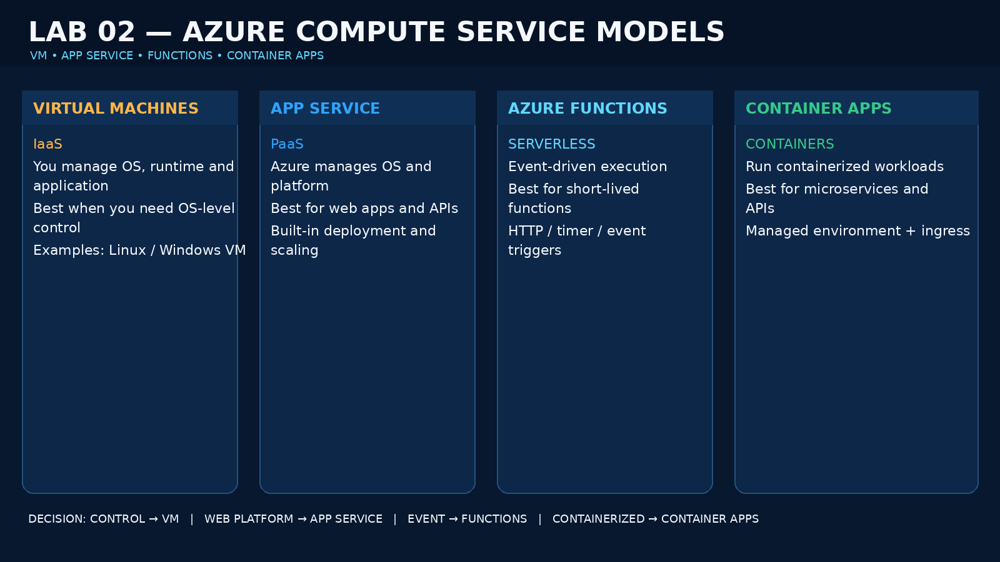

**Use before Part 0.**

---

## INFOGRAPHIC 2 — Azure Linux VM Anatomy

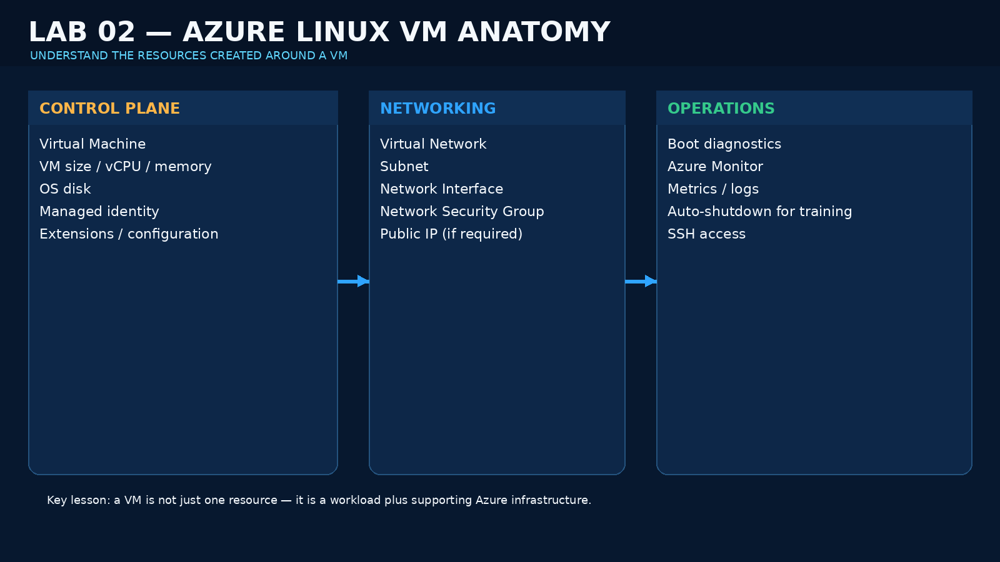

**Use before the VM exercise.**

---

## INFOGRAPHIC 3 — Azure App Service Architecture

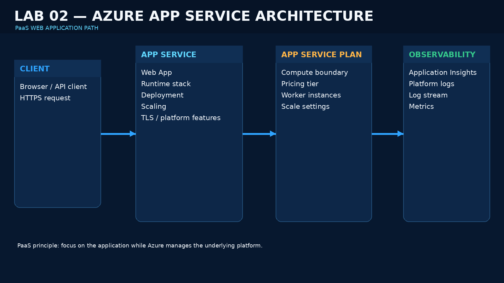

**Use before the App Service exercise.**

---

## INFOGRAPHIC 4 — Azure Functions Execution Flow

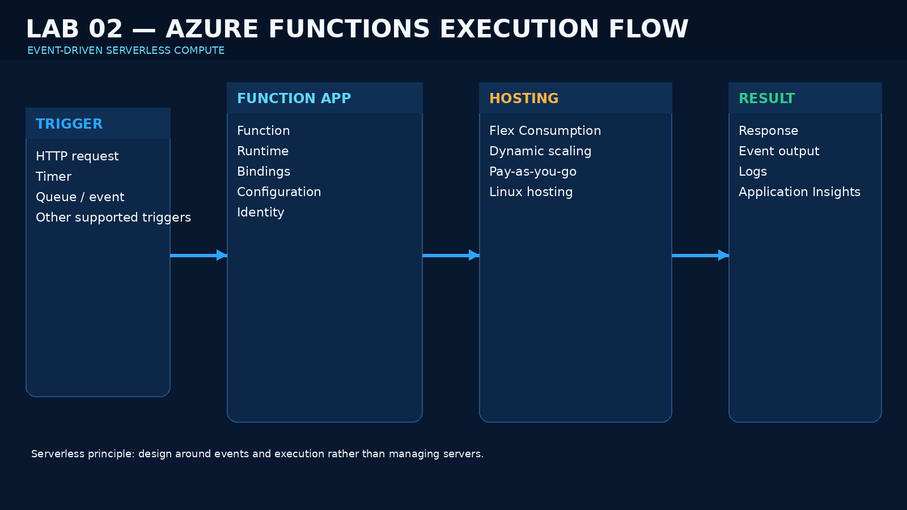

**Use before the Functions exercise.**

---

## INFOGRAPHIC 5 — Azure Container Apps Architecture

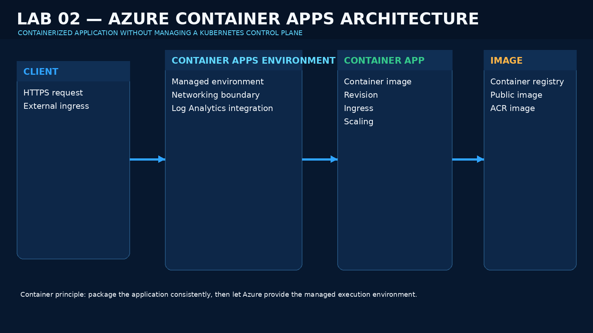

**Use before the Container Apps exercise.**

---

# 🚨 REAL-WORLD INCIDENT INFOGRAPHICS

## INCIDENT 01 — VM Web Server Inaccessible

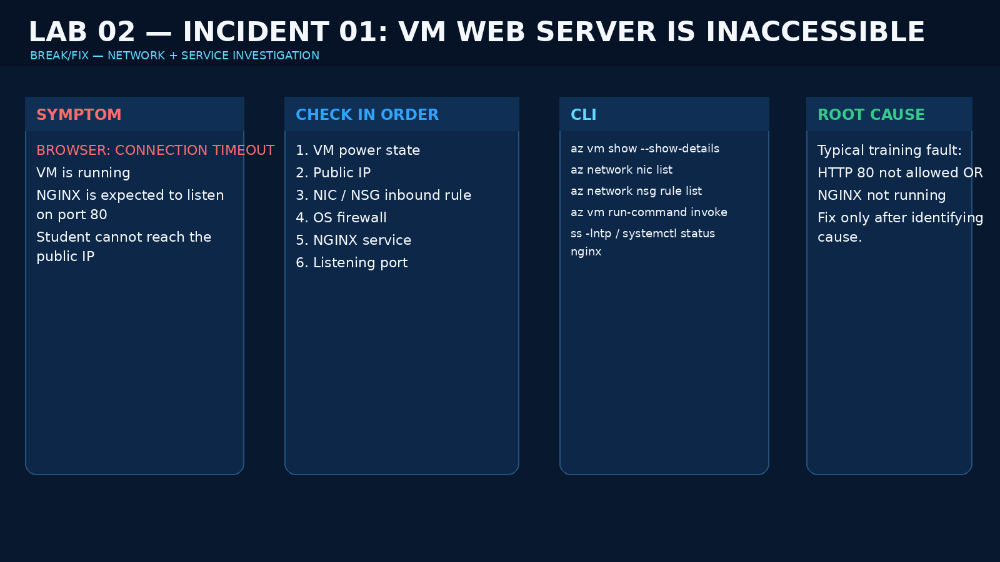

**Scenario:** The VM is running but the web server cannot be reached.

---

## INCIDENT 02 — App Service Returns 503

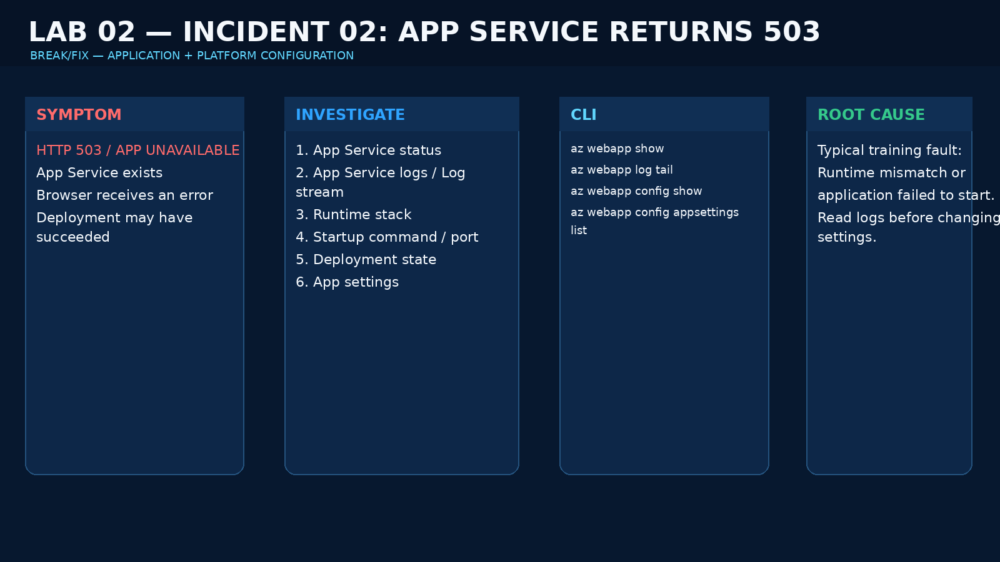

**Scenario:** The App Service exists, but the application is unavailable.

---

## INCIDENT 03 — Container App Port Problem

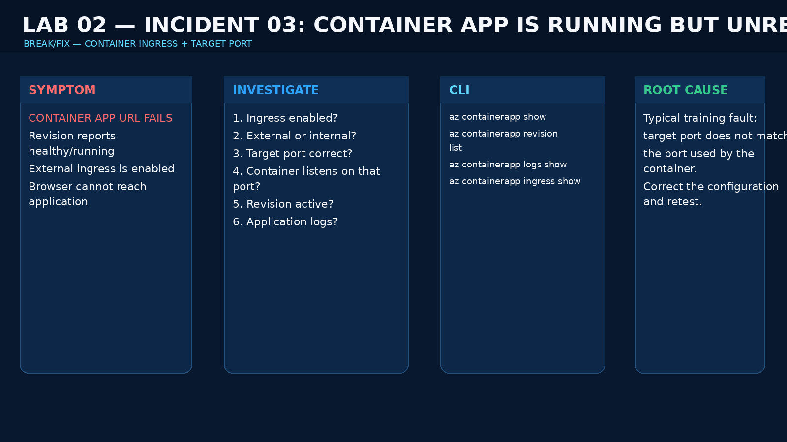

**Scenario:** The Container App is running, but external traffic cannot reach the application.

---

# 📊 DIAGRAMS & ARCHITECTURE VISUALIZATION

## 1. Mermaid — Compute Decision Architecture

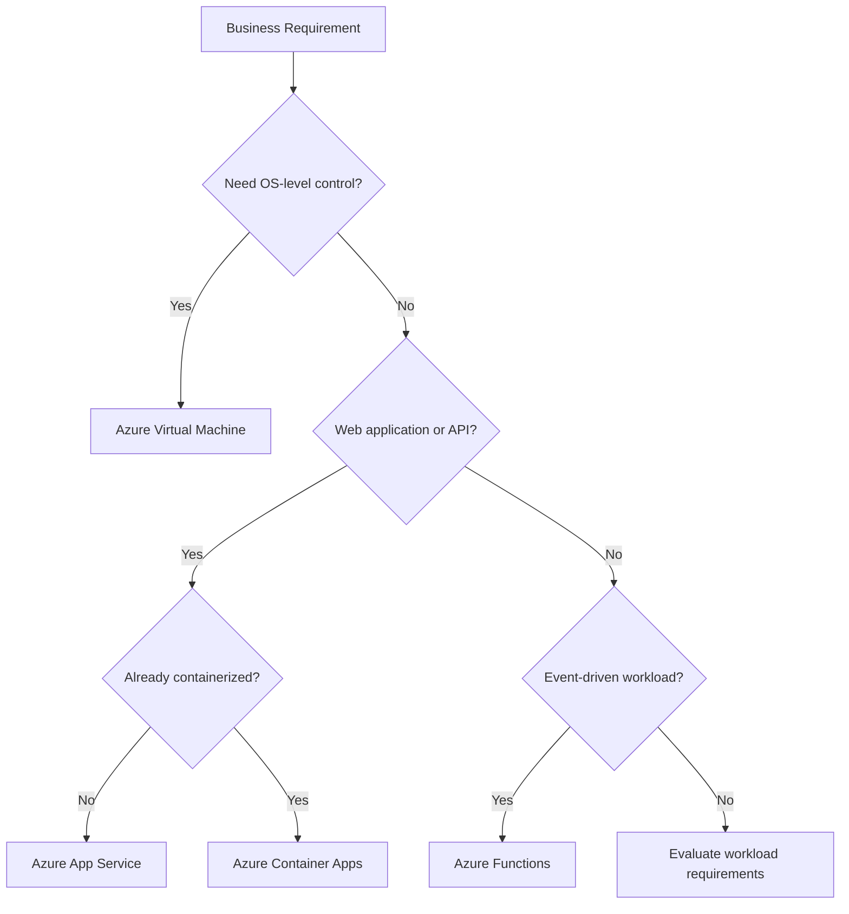

---

## 2. Mermaid — VM Network Architecture

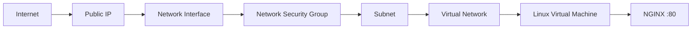

---

## 3. Mermaid — App Service Architecture

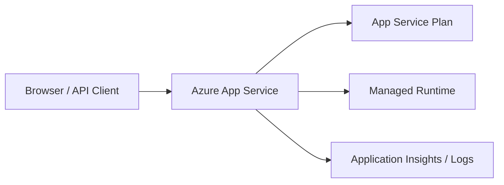

---

## 4. Mermaid — Functions Execution Flow

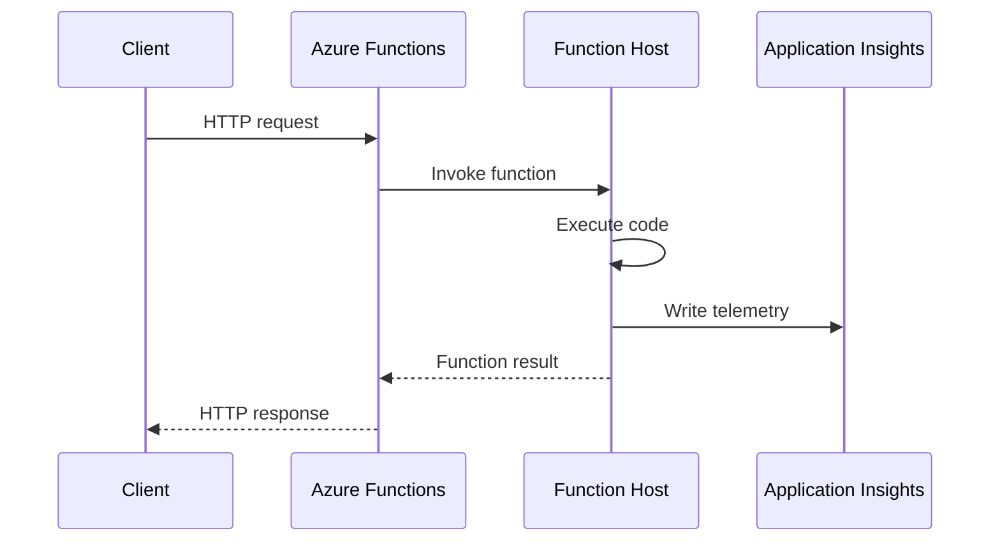

---

## 5. Mermaid — Container Apps Request Flow

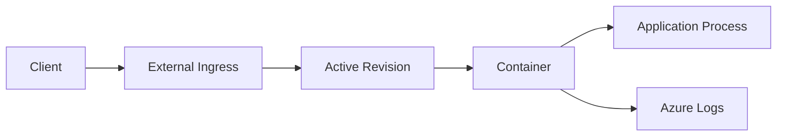

---

# UML-STYLE DIAGRAMS

> GitHub/GitLab can render Mermaid diagrams directly. The UML-style diagrams below use Mermaid syntax so the lab remains portable as a single Markdown document.

## UML Use Case — Compute Engineer

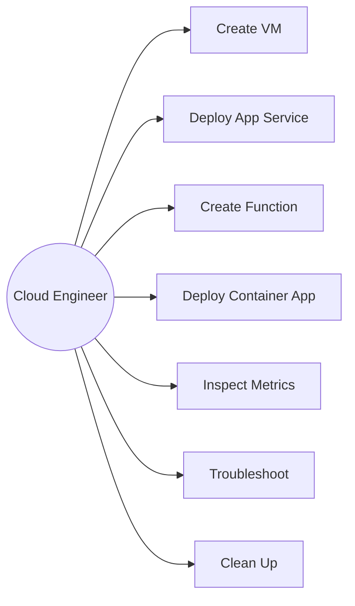

---

## UML Class Diagram — Compute Components

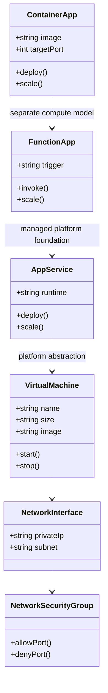

---

## UML Sequence — VM Troubleshooting

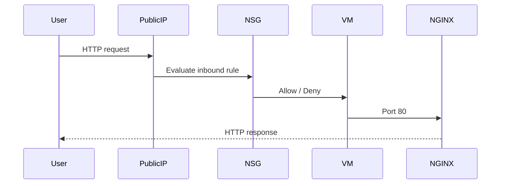

---

# 🟦 PART 0 — UNDERSTAND AZURE COMPUTE

Before deploying anything, answer:

### Question 1

Which model gives the engineer the most operating-system control?

**Instructor answer:** Azure Virtual Machines.

### Question 2

Which model is designed to reduce operating-system management for web applications?

**Instructor answer:** Azure App Service.

### Question 3

Which model is strongly associated with event-driven execution?

**Instructor answer:** Azure Functions.

### Question 4

Which service lets you run containerized applications without managing a Kubernetes control plane?

**Instructor answer:** Azure Container Apps.

---

# 🧭 COMPUTE DECISION MATRIX

| Requirement | VM | App Service | Functions | Container Apps |
|---|---:|---:|---:|---:|
| OS-level control | ✅ | ❌ | ❌ | ❌ |
| Managed web platform | ❌ | ✅ | ⚠️ | ✅ |
| Event-driven | ⚠️ | ⚠️ | ✅ | ⚠️ |
| Container-native | ⚠️ | ⚠️ | ⚠️ | ✅ |
| Serverless model | ❌ | ❌ | ✅ | Managed |
| SSH to OS | ✅ | ❌ | ❌ | ❌ |
| Simple web app | ⚠️ | ✅ | ⚠️ | ✅ |
| Microservice container | ⚠️ | ⚠️ | ⚠️ | ✅ |

> ⚠️ Means the capability may exist but is not the primary reason to choose that service.

---

# 🖱️ PART 1 — AZURE PORTAL: CREATE A LINUX VM

## Step 1 — Open Azure Portal

Open:

```text
https://portal.azure.com/
```

---

## Step 2 — Create the VM

Search:

```text
Virtual machines
```

Select:

```text
Virtual machines
→ Create
→ Azure virtual machine
```

---

## Step 3 — Basics

Use:

```text
Subscription:
<YOUR SUBSCRIPTION>

Resource Group:
rg-contoso-compute

VM Name:
vm-contoso-web

Region:
<YOUR SUPPORTED REGION>

Availability options:
No infrastructure redundancy required
```

For the image, select a supported Linux image.

For a training lab, use a small VM size available in your region.

---

## Step 4 — Administrator Account

Choose:

```text
Authentication type:
SSH public key

Username:
azureuser
```

Generate or provide an SSH key.

---

## Step 5 — Inbound Ports

For the lab:

```text
SSH (22)
HTTP (80)
```

> In production, do not expose administrative access broadly. Prefer controlled access mechanisms such as Azure Bastion, private networking, or just-in-time access where appropriate.

---

## Step 6 — Review + Create

Select:

```text
Review + create
```

Wait for validation.

Then:

```text
Create
```

---

# 🖱️ PART 2 — VM PORTAL VALIDATION

Open:

```text
Virtual machines
→ vm-contoso-web
```

Record:

```text
VM Name:
____________________

Region:
____________________

VM Size:
____________________

Power State:
____________________

Public IP:
____________________

Private IP:
____________________
```

Inspect:

```text
Networking
→ Network interface
→ Subnets
→ Network security group
```

---

# 💻 PART 3 — CONNECT TO THE VM

Retrieve the public IP:

```bash
az vm show \
  --show-details \
  --resource-group rg-contoso-compute \
  --name vm-contoso-web \
  --query publicIps \
  --output tsv
```

SSH:

```bash
ssh -i <PRIVATE_KEY_PATH> azureuser@<PUBLIC_IP>
```

---

# 🌐 PART 4 — INSTALL NGINX

Inside the VM:

```bash
sudo apt-get update
sudo apt-get install -y nginx
```

Check:

```bash
systemctl status nginx
```

Verify:

```bash
curl http://localhost
```

Find the VM public IP and browse:

```text
http://<PUBLIC_IP>
```

Expected:

```text
NGINX default page
```

---

# 💻 PART 5 — CREATE THE VM WITH AZURE CLI

From Azure Cloud Shell:

```bash
az group create \
  --name rg-contoso-compute \
  --location <REGION>
```

Create the VM:

```bash
az vm create \
  --resource-group rg-contoso-compute \
  --name vm-contoso-web-cli \
  --image Ubuntu2204 \
  --size Standard_B1s \
  --admin-username azureuser \
  --generate-ssh-keys \
  --public-ip-sku Standard
```

> VM image and size availability can vary by region. If Azure rejects the selected image or SKU, query available options rather than guessing.

---

# 🔎 PART 6 — VM CLI INVESTIGATION

Check:

```bash
az vm show \
  --resource-group rg-contoso-compute \
  --name vm-contoso-web-cli \
  --output json
```

Check power state:

```bash
az vm get-instance-view \
  --resource-group rg-contoso-compute \
  --name vm-contoso-web-cli \
  --query instanceView.statuses \
  --output table
```

List NICs:

```bash
az network nic list \
  --resource-group rg-contoso-compute \
  --output table
```

List public IPs:

```bash
az network public-ip list \
  --resource-group rg-contoso-compute \
  --output table
```

List NSGs:

```bash
az network nsg list \
  --resource-group rg-contoso-compute \
  --output table
```

---

# 🧠 STUDENT TASK — VM RESOURCE MAP

Complete:

```text
VM
 │
 ├── OS Disk
 │
 ├── NIC
 │     └── Private IP
 │
 ├── Public IP
 │
 ├── NSG
 │
 └── VNet
       └── Subnet
```

Explain the purpose of each component.

---

# 🟦 PART 7 — AZURE APP SERVICE

Now compare VM-based hosting with PaaS.

## Portal path

```text
Azure Portal
→ Create a resource
→ Web App
```

Configure:

```text
Subscription:
<YOUR SUBSCRIPTION>

Resource Group:
rg-contoso-compute

Name:
<globally-unique-name>

Publish:
Code

Runtime stack:
Node.js

Operating System:
Linux

Region:
<REGION>
```

Create an App Service Plan.

For a low-cost training exercise, use an available Free tier if supported.

Then:

```text
Review + create
→ Create
```

---

# 💻 APP SERVICE CLI

Microsoft's current App Service quickstart supports:

```bash
az webapp up --sku F1 --name <APP_NAME>
```

Run it from a local Node.js application directory.

For example:

```bash
mkdir compute-webapp
cd compute-webapp
```

Create a simple application:

```bash
cat > package.json <<'EOF'
{
  "scripts": {
    "start": "node server.js"
  },
  "dependencies": {
    "express": "^5.1.0"
  }
}
EOF
```

Create:

```bash
cat > server.js <<'EOF'
const express = require("express");
const app = express();

const port = process.env.PORT || 3000;

app.get("/", (req, res) => {
  res.send("Contoso Compute Lab - Azure App Service");
});

app.listen(port, () => {
  console.log(`Listening on port ${port}`);
});
EOF
```

Install:

```bash
npm install
```

Deploy:

```bash
az webapp up \
  --sku F1 \
  --name <GLOBALLY_UNIQUE_APP_NAME>
```

Get the default hostname:

```bash
az webapp show \
  --name <APP_NAME> \
  --resource-group <RESOURCE_GROUP> \
  --query defaultHostName \
  --output tsv
```

---

# 🖱️ APP SERVICE PORTAL VALIDATION

Open:

```text
App Services
→ <APP_NAME>
```

Inspect:

```text
Overview
Configuration
Deployment Center
Monitoring
Log stream
Properties
```

Question:

> What does Azure manage for you compared with the VM?

**Instructor answer:** App Service abstracts much of the operating-system and platform management so the engineer can focus more on the application, configuration, deployment and scaling.

---

# 🟪 PART 8 — AZURE FUNCTIONS

For this lab, use an HTTP-triggered Function.

Microsoft currently documents **Flex Consumption** as the recommended serverless hosting option for Azure Functions.

## Portal path

```text
Azure Portal
→ Create a resource
→ Function App
→ Select hosting option
→ Flex Consumption
```

Configure:

```text
Subscription:
<YOUR SUBSCRIPTION>

Resource Group:
rg-contoso-compute

Function App:
<globally-unique-name>

Region:
<REGION>

Runtime:
Python / Node.js / another supported runtime
```

Review the remaining configuration.

Then:

```text
Review + create
→ Create
```

---

# 💻 FUNCTIONS CLI

Azure Functions creation depends on the language and current Functions hosting model.

Use the current Microsoft quickstart for the selected runtime and create the project locally.

For Python, the general workflow is:

```text
Install Azure Functions Core Tools
        ↓
Create local function project
        ↓
Create HTTP trigger
        ↓
Run locally
        ↓
Create Azure Function App
        ↓
Deploy
        ↓
Invoke HTTP endpoint
```

Validate your local tooling:

```bash
func --version
```

Then follow the current Microsoft Functions CLI workflow for your chosen runtime.

---

# 🧪 FUNCTION VALIDATION

Your HTTP-triggered function should produce a valid HTTP response.

Record:

```text
Function App:
________________________

Function:
________________________

Trigger:
HTTP

Endpoint:
________________________
```

Inspect:

```text
Function App
→ Functions
→ <Function>
→ Monitor
```

---

# 🟩 PART 9 — AZURE CONTAINER APPS

Container Apps provides a managed platform for containerized applications.

## Portal path

```text
Azure Portal
→ Search
→ Container Apps
→ Create
```

Configure:

```text
Subscription:
<YOUR SUBSCRIPTION>

Resource Group:
rg-contoso-compute

Container App Name:
contoso-container-app

Environment:
Create new

Deployment source:
Container image
```

Use a simple public image for the training exercise.

Configure:

```text
Ingress:
External

Target Port:
<PORT USED BY THE CONTAINER>
```

Then:

```text
Review + create
→ Create
```

---

# 💻 CONTAINER APPS CLI

Ensure the extension is available:

```bash
az extension add \
  --name containerapp \
  --upgrade
```

Register providers if required:

```bash
az provider register \
  --namespace Microsoft.App

az provider register \
  --namespace Microsoft.OperationalInsights
```

Create the environment:

```bash
az containerapp env create \
  --name contoso-compute-env \
  --resource-group rg-contoso-compute \
  --location <REGION>
```

Deploy a simple public container image:

```bash
az containerapp up \
  --name contoso-container-app \
  --resource-group rg-contoso-compute \
  --location <REGION> \
  --environment contoso-compute-env \
  --image mcr.microsoft.com/k8se/quickstart:latest \
  --target-port 80 \
  --ingress external
```

Inspect:

```bash
az containerapp show \
  --name contoso-container-app \
  --resource-group rg-contoso-compute \
  --output json
```

Get ingress:

```bash
az containerapp show \
  --name contoso-container-app \
  --resource-group rg-contoso-compute \
  --query properties.configuration.ingress.fqdn \
  --output tsv
```

---

# 🧱 PART 10 — BICEP

The goal is not to replace learning with Bicep.

The goal is to show how the same infrastructure becomes repeatable.

Create:

```text
infra/
└── main.bicep
```

Example App Service Bicep:

```bicep
param location string = resourceGroup().location
param webAppName string

resource plan 'Microsoft.Web/serverfarms@2024-11-01' = {
  name: '${webAppName}-plan'
  location: location
  kind: 'linux'
  sku: {
    name: 'F1'
    tier: 'Free'
  }
  properties: {
    reserved: true
  }
}

resource app 'Microsoft.Web/sites@2024-11-01' = {
  name: webAppName
  location: location
  kind: 'app,linux'
  properties: {
    serverFarmId: plan.id
    siteConfig: {
      linuxFxVersion: 'NODE|24-lts'
    }
  }
}

output defaultHostName string = app.properties.defaultHostName
```

> **API version note:** Azure resource API versions change. If your current Bicep tooling recommends a newer stable API version, use the current Microsoft documentation and record the version you used.

Validate:

```bash
az bicep build \
  --file infra/main.bicep
```

Run what-if:

```bash
az deployment group what-if \
  --resource-group rg-contoso-compute \
  --template-file infra/main.bicep \
  --parameters webAppName=<APP_NAME>
```

Deploy:

```bash
az deployment group create \
  --resource-group rg-contoso-compute \
  --template-file infra/main.bicep \
  --parameters webAppName=<APP_NAME>
```

Verify:

```bash
az webapp show \
  --name <APP_NAME> \
  --resource-group rg-contoso-compute \
  --output table
```

---

# 🤖 PART 11 — GITHUB COPILOT

GitHub Copilot is an assistant, not an authority.

## Exercise 1 — Compute Recommendation

Ask:

```text
I am designing a small retail web workload in Azure.

Compare:
1. Azure Virtual Machines
2. Azure App Service
3. Azure Functions
4. Azure Container Apps

Evaluate:
- operational responsibility
- scaling
- deployment model
- networking
- cost considerations
- workload fit

Do not deploy anything.

Give me a decision matrix.
```

Then verify the recommendations against Microsoft documentation.

---

## Exercise 2 — CLI Assistance

Ask:

```text
Create an Azure CLI command to inspect:
- VM power state
- public IP
- NIC
- NSG
- subnet

Use read-only commands.
Explain every command.
Do not make changes.
```

---

## Exercise 3 — Bicep Assistance

Ask:

```text
Generate a Bicep template for an Azure App Service Linux web app.

Requirements:
- parameterized location
- parameterized globally unique app name
- Linux App Service Plan
- Free F1 tier for training
- Node.js runtime
- output default hostname

Explain every resource.
Do not add unrelated Azure resources.
```

Then compare the output against your Bicep.

---

# 🧠 COPILOT REVIEW RULE

Use:

```text
PROMPT
   ↓
COPILOT
   ↓
ENGINEER REVIEW
   ↓
MICROSOFT DOCUMENTATION
   ↓
VALIDATION / WHAT-IF
   ↓
DEPLOY
   ↓
VERIFY
```

Never use:

```text
COPILOT
   ↓
COPY
   ↓
PRODUCTION
```

---

# 🚨 PART 12 — REAL-WORLD TROUBLESHOOTING

# INCIDENT 01 — VM WEB SERVER IS INACCESSIBLE

## Scenario

Your manager says:

> "The VM is running, but the web application is not reachable."

Do not immediately recreate the VM.

Investigate.

---

## Investigation 1 — VM state

```bash
az vm get-instance-view \
  --resource-group rg-contoso-compute \
  --name vm-contoso-web \
  --query instanceView.statuses \
  --output table
```

---

## Investigation 2 — Public IP

```bash
az vm show \
  --show-details \
  --resource-group rg-contoso-compute \
  --name vm-contoso-web \
  --query publicIps \
  --output tsv
```

---

## Investigation 3 — NSG

```bash
az network nsg list \
  --resource-group rg-contoso-compute \
  --output table
```

Then inspect rules:

```bash
az network nsg rule list \
  --resource-group rg-contoso-compute \
  --nsg-name <NSG_NAME> \
  --output table
```

---

## Investigation 4 — Service

SSH into the VM:

```bash
ssh -i <PRIVATE_KEY_PATH> azureuser@<PUBLIC_IP>
```

Check:

```bash
sudo systemctl status nginx
```

Check listening ports:

```bash
sudo ss -lntp
```

---

## Possible root causes

- VM stopped
- incorrect public IP
- NSG does not allow TCP/80
- OS firewall blocks traffic
- NGINX is stopped
- NGINX listens on another port
- incorrect URL

### Instructor answer

Do not assume the root cause.

The professional workflow is:

```text
SYMPTOM
 ↓
SCOPE
 ↓
NETWORK PATH
 ↓
SECURITY RULE
 ↓
OS
 ↓
APPLICATION
 ↓
ROOT CAUSE
```

---

# INCIDENT 02 — APP SERVICE RETURNS 503

## Scenario

The App Service exists, but users receive:

```text
HTTP 503
```

---

## Investigation

Check application:

```bash
az webapp show \
  --name <APP_NAME> \
  --resource-group <RESOURCE_GROUP> \
  --output table
```

Inspect configuration:

```bash
az webapp config show \
  --name <APP_NAME> \
  --resource-group <RESOURCE_GROUP>
```

View logs:

```bash
az webapp log tail \
  --name <APP_NAME> \
  --resource-group <RESOURCE_GROUP>
```

Check app settings:

```bash
az webapp config appsettings list \
  --name <APP_NAME> \
  --resource-group <RESOURCE_GROUP> \
  --output table
```

---

## Troubleshooting decision tree

```text
503
 ↓
APP RUNNING?
 ↓
LOG STREAM
 ↓
RUNTIME CORRECT?
 ↓
START COMMAND CORRECT?
 ↓
PORT CORRECT?
 ↓
APP STARTS?
 ↓
RETEST
```

### Instructor answer

A 503 is a symptom, not a root cause.

Students should inspect platform and application logs before changing the architecture.

---

# INCIDENT 03 — CONTAINER APP RUNNING BUT UNREACHABLE

## Scenario

The Container App reports a healthy/running revision.

The URL does not work.

---

## Check application

```bash
az containerapp show \
  --name contoso-container-app \
  --resource-group rg-contoso-compute
```

Check revisions:

```bash
az containerapp revision list \
  --name contoso-container-app \
  --resource-group rg-contoso-compute \
  --output table
```

Check logs:

```bash
az containerapp logs show \
  --name contoso-container-app \
  --resource-group rg-contoso-compute
```

Inspect ingress:

```bash
az containerapp ingress show \
  --name contoso-container-app \
  --resource-group rg-contoso-compute
```

---

## Key question

What port does the application actually listen on?

Compare:

```text
Container listening port
        VS
Azure Container Apps target port
```

### Instructor answer

If these values do not match, external requests may fail even though the container itself is running.

---

# 🧪 PART 13 — STUDENT COMPUTE DECISION CHALLENGE

Your manager gives you four workloads.

## Workload A

Legacy application requires:

- custom OS packages
- SSH
- full OS control

Choose:

```text
____________________
```

Expected:

**Azure Virtual Machine**

---

## Workload B

Simple public web application.

Requirements:

- minimal infrastructure management
- managed runtime
- easy deployment

Choose:

```text
____________________
```

Expected:

**Azure App Service**

---

## Workload C

An HTTP endpoint executes a small piece of code when requested.

Choose:

```text
____________________
```

Expected:

**Azure Functions**

---

## Workload D

A containerized API must run with managed ingress and scaling.

Choose:

```text
____________________
```

Expected:

**Azure Container Apps**

---

# 🧠 ARCHITECTURE QUESTION

A customer says:

> "We want to use VMs because VMs are the most powerful Azure compute option."

Respond as an architect.

Your answer should discuss:

- control
- operational overhead
- patching
- scaling
- deployment
- workload characteristics
- cost
- security

### Instructor answer

The most powerful option is not automatically the best option.

The correct Azure compute service depends on the workload and operational requirements.

---

# 🧪 PART 14 — ACCEPTANCE CRITERIA

You have completed Lab 02 when you can demonstrate:

- [ ] IaaS explained
- [ ] PaaS explained
- [ ] Serverless explained
- [ ] Containers explained
- [ ] Linux VM deployed
- [ ] VM connected through SSH
- [ ] NGINX installed
- [ ] HTTP access validated
- [ ] VM supporting resources identified
- [ ] App Service deployed
- [ ] App Service Plan explained
- [ ] Application endpoint validated
- [ ] Azure Function created
- [ ] HTTP trigger tested
- [ ] Container App deployed
- [ ] Container ingress tested
- [ ] Azure CLI used for compute investigation
- [ ] Bicep built and validated
- [ ] Bicep what-if performed
- [ ] GitHub Copilot used for engineering assistance
- [ ] Copilot output verified against Microsoft documentation
- [ ] VM incident investigated
- [ ] App Service incident investigated
- [ ] Container App incident investigated
- [ ] Architecture decision documented
- [ ] Evidence captured
- [ ] Resources cleaned up

---

# 📦 PART 15 — GITHUB / GITLAB PORTFOLIO

Recommended structure:

```text
02-azure-compute-services/
│
├── README.md
│
├── architecture/
│   ├── compute-decision.md
│   ├── vm-network.md
│   ├── app-service.md
│   └── container-apps.md
│
├── infra/
│   └── main.bicep
│
├── screenshots/
│   ├── vm-overview.png
│   ├── vm-networking.png
│   ├── app-service.png
│   ├── function.png
│   └── container-app.png
│
├── troubleshooting/
│   ├── incident-01-vm.md
│   ├── incident-02-app-service.md
│   └── incident-03-container-app.md
│
└── decisions/
    └── compute-service-selection.md
```

---

# 💼 PART 16 — RESUME OUTCOME

Students should describe the project truthfully as hands-on project work.

### Resume bullet 1

> Designed and deployed Azure compute workloads using Virtual Machines, App Service, Azure Functions and Azure Container Apps, comparing IaaS, PaaS, serverless and managed container execution models.

### Resume bullet 2

> Provisioned and validated Linux virtual machines with Azure CLI, SSH, networking interfaces, public IP addressing and network security controls.

### Resume bullet 3

> Deployed a web workload to Azure App Service and investigated runtime, configuration and application availability issues using Azure CLI and platform logs.

### Resume bullet 4

> Implemented an HTTP-triggered Azure Function and evaluated serverless execution for event-driven workloads.

### Resume bullet 5

> Deployed a containerized workload to Azure Container Apps and troubleshot ingress and target-port configuration.

### Resume bullet 6

> Used Bicep to define repeatable Azure infrastructure and performed deployment validation using Azure Resource Manager what-if operations.

### Resume bullet 7

> Used GitHub Copilot to accelerate Azure CLI and Bicep development while validating generated output against Microsoft documentation and deployment results.

---

# 🧑‍💻 PART 17 — INTERVIEW QUESTIONS + ANSWERS

## 1. What is Azure Virtual Machines?

**Answer:** Azure Virtual Machines provide IaaS compute where the customer manages the operating system, applications and much of the configuration while Azure manages the underlying physical infrastructure.

---

## 2. When would you choose a VM instead of App Service?

**Answer:** When the workload requires OS-level control, custom software, legacy dependencies, specialized configuration or other capabilities not appropriate for a managed web platform.

---

## 3. What is an App Service Plan?

**Answer:** It defines the compute resources and pricing tier used by App Service applications. Apps can share an App Service Plan.

---

## 4. What is Azure Functions?

**Answer:** Azure Functions is a serverless compute platform designed for event-driven execution.

---

## 5. What is the main difference between App Service and Functions?

**Answer:** App Service is primarily a managed application hosting platform, while Functions is designed around event-driven function execution and serverless workloads.

---

## 6. What is Azure Container Apps?

**Answer:** It is a managed platform for running containerized applications and microservices without requiring the customer to manage a Kubernetes control plane.

---

## 7. Why can a running VM still be unreachable?

**Answer:** The VM being powered on does not prove network connectivity. NSGs, routing, public IP configuration, OS firewall rules, service state and listening ports can all cause failures.

---

## 8. How would you troubleshoot a VM web server?

**Answer:**

```text
VM state
→ Public IP
→ NIC
→ NSG
→ OS firewall
→ Listening port
→ Application service
→ Logs
```

---

## 9. What does a 503 from App Service tell you?

**Answer:** It indicates service unavailability from the client's perspective, but it does not by itself identify the root cause. Logs, runtime configuration, startup behavior and deployment state must be investigated.

---

## 10. Why is the target port important in Container Apps?

**Answer:** The target port tells the ingress layer which port the application inside the container is expected to receive traffic on. A mismatch can make a running container unreachable.

---

## 11. What is IaaS?

**Answer:** Infrastructure as a Service provides virtualized infrastructure such as compute, networking and storage while leaving more management responsibility with the customer.

---

## 12. What is PaaS?

**Answer:** Platform as a Service abstracts more of the infrastructure and platform management so developers can focus on application deployment and operation.

---

## 13. What is serverless?

**Answer:** Serverless abstracts server management and typically charges based on execution or managed consumption characteristics. Azure Functions is a key Azure serverless compute service.

---

## 14. Why should an engineer compare compute models before deployment?

**Answer:** Because the wrong compute model can increase cost, operational burden, security complexity and deployment effort.

---

## 15. Which compute model gives the most control?

**Answer:** Virtual Machines.

---

## 16. Which service would you consider for a simple managed web application?

**Answer:** Azure App Service is a strong candidate.

---

## 17. Which service would you consider for event-driven code?

**Answer:** Azure Functions.

---

## 18. Which service would you consider for a containerized microservice?

**Answer:** Azure Container Apps is a strong candidate when managed container execution is desired without managing a Kubernetes control plane.

---

## 19. Why use Bicep instead of only the Portal?

**Answer:** Bicep provides declarative, repeatable and version-controlled infrastructure definitions.

---

## 20. Should Copilot-generated Azure commands be executed blindly?

**Answer:** No. Engineers must review, validate and test AI-generated output against authoritative documentation and the intended environment.

---

# 🎤 SCENARIO-BASED INTERVIEW QUESTIONS

## Scenario 1

A VM is running but users receive connection timeouts.

**How do you troubleshoot?**

Expected structure:

```text
VM
→ IP
→ NIC
→ NSG
→ Route
→ OS firewall
→ Port
→ Application
```

---

## Scenario 2

An App Service deployment succeeds but the application returns 503.

**What do you inspect first?**

Expected:

```text
Application status
→ Log stream
→ Runtime
→ Startup configuration
→ Application logs
→ Deployment state
```

---

## Scenario 3

A Container App revision is running but the application URL fails.

**What do you inspect?**

Expected:

```text
Ingress
→ Target Port
→ Container listening port
→ Revision
→ Application logs
```

---

## Scenario 4

A customer asks you to deploy everything on VMs.

**What should you ask before accepting the design?**

Expected:

- workload requirements
- OS control requirement
- scaling
- patching responsibility
- availability
- security
- cost
- operational team capability
- application architecture

---

# 🏆 PART 18 — ADVANCED CHALLENGE

Design a compute strategy for:

```text
Contoso Retail
│
├── Legacy ERP
├── Public Web Store
├── Order Processing API
└── Scheduled Inventory Job
```

Choose a compute model for each.

| Workload | Selected Service | Reason |
|---|---|---|
| Legacy ERP | | |
| Public Web Store | | |
| Order API | | |
| Inventory Job | | |

Then create:

```text
decisions/
└── compute-service-selection.md
```

Document:

```text
Requirement
↓
Options considered
↓
Advantages
↓
Disadvantages
↓
Security
↓
Operations
↓
Cost
↓
Final decision
```

---

# 🧹 PART 19 — CLEANUP

List resources before deletion:

```bash
az resource list \
  --resource-group rg-contoso-compute \
  --output table
```

Confirm:

```text
Resource Group:
rg-contoso-compute
```

Then delete:

```bash
az group delete \
  --name rg-contoso-compute \
  --yes \
  --no-wait
```

Verify:

```bash
az group exists \
  --name rg-contoso-compute
```

Expected:

```text
false
```

> ⚠️ Never run resource-group deletion commands against production environments without confirming scope, authorization and change approval.

---

# 📚 OFFICIAL MICROSOFT REFERENCES

Use current Microsoft documentation when Azure Portal fields, supported regions, runtime versions, image names or CLI behavior changes.

### Azure Virtual Machines

https://learn.microsoft.com/en-us/azure/virtual-machines/

### Linux VM — Azure CLI Quickstart

https://learn.microsoft.com/en-us/azure/virtual-machines/linux/quick-create-cli

### Linux VM — Azure Portal Quickstart

https://learn.microsoft.com/en-us/azure/azure-linux/quick-create-vm-portal

### Azure App Service

https://learn.microsoft.com/en-us/azure/app-service/

### App Service — Node.js Quickstart

https://learn.microsoft.com/en-us/azure/app-service/quickstart-nodejs

### Azure Functions

https://learn.microsoft.com/en-us/azure/azure-functions/

### Create Function App in Portal

https://learn.microsoft.com/en-us/azure/azure-functions/functions-create-function-app-portal

### Azure Functions with Bicep

https://learn.microsoft.com/en-us/azure/azure-functions/functions-create-first-function-bicep

### Azure Container Apps

https://learn.microsoft.com/en-us/azure/container-apps/

### Container Apps Quickstart

https://learn.microsoft.com/en-us/azure/container-apps/get-started

### Azure CLI

https://learn.microsoft.com/en-us/cli/azure/

### Bicep

https://learn.microsoft.com/en-us/azure/azure-resource-manager/bicep/

### GitHub Copilot for Azure

https://learn.microsoft.com/en-us/azure/developer/github-copilot-azure/

---

# 🏁 LAB COMPLETION CHECKLIST

```text
COMPUTE CONCEPTS
[ ] IaaS understood
[ ] PaaS understood
[ ] Serverless understood
[ ] Containers understood

VIRTUAL MACHINE
[ ] VM created
[ ] SSH tested
[ ] NGINX installed
[ ] Public IP identified
[ ] NIC identified
[ ] NSG identified
[ ] VM investigated with CLI

APP SERVICE
[ ] App Service created
[ ] App Service Plan understood
[ ] Application deployed
[ ] Logs inspected

FUNCTIONS
[ ] Function App created
[ ] HTTP trigger tested
[ ] Hosting model understood

CONTAINER APPS
[ ] Environment created
[ ] Container App deployed
[ ] Ingress tested
[ ] Target port understood

BICEP
[ ] Bicep created
[ ] Bicep built
[ ] What-if performed
[ ] Deployment validated

COPILOT
[ ] Compute comparison generated
[ ] CLI assistance used
[ ] Bicep assistance used
[ ] AI output reviewed

TROUBLESHOOTING
[ ] VM incident solved
[ ] App Service incident investigated
[ ] Container App incident investigated

PORTFOLIO
[ ] Architecture documented
[ ] Compute decision documented
[ ] Screenshots captured
[ ] Troubleshooting notes committed
[ ] Resume bullets prepared

CLEANUP
[ ] Resources reviewed
[ ] Training Resource Group deleted
```

---

# 🚀 NEXT LAB

## LAB 03 — AZURE STORAGE SERVICES

The progression continues:

```text
LAB 01
AZURE ENVIRONMENT
      ↓
LAB 02
COMPUTE
      ↓
LAB 03
STORAGE
      ↓
LAB 04
NETWORKING
      ↓
LAB 05
IDENTITY
      ↓
LAB 06
MONITORING
      ↓
LAB 07
GOVERNANCE
      ↓
LAB 08
MINI APPLICATION
```

The student is progressively building Azure engineering capability rather than completing unrelated demos.

> **BUILD IT. DEPLOY IT. BREAK IT. TROUBLESHOOT IT. AUTOMATE IT.**
