# 🧪 LAB 03 — AZURE STORAGE SERVICES
## Storage Accounts • Blob Storage • Azure Files • Queues • Tables • Security • Redundancy • Troubleshooting

> **Course:** Azure Cloud Engineering • Architecture • DevOps  
> **Lab:** 03 of 40  
> **Level:** AZ-900 → AZ-104 → AZ-305 foundation  
> **Primary Azure focus:** Azure Storage  
> **Delivery model:** Live instructor-led + hands-on Azure Portal + Azure CLI + Bicep + troubleshooting

---

## 🎯 Lab Mission

In this lab you will work like an Azure Cloud Engineer responsible for designing, deploying, securing and troubleshooting Azure Storage.

You will build a storage environment for a fictional **Contoso Retail** workload and learn how to:

- create and inspect an Azure Storage Account
- understand Blob, Files, Queue and Table services
- create containers and upload/download blobs
- use Microsoft Entra ID and Azure RBAC for storage data operations
- compare SAS, keys and identity-based access
- configure and reason about storage networking
- create an Azure File Share
- understand storage redundancy choices
- use Azure CLI and Bicep
- troubleshoot realistic storage incidents
- use GitHub Copilot as an engineering assistant without blindly trusting generated commands

> **Important:** Azure Storage features, SKU availability, networking capabilities and portal labels can change. Validate the current Microsoft documentation for your selected region and subscription before teaching a live cohort.

---

# 🏗️ Architecture Overview

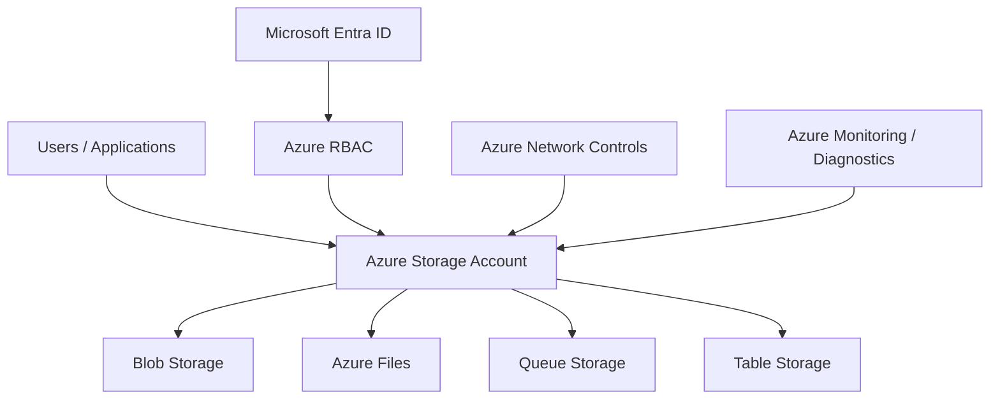

### UML-style component view

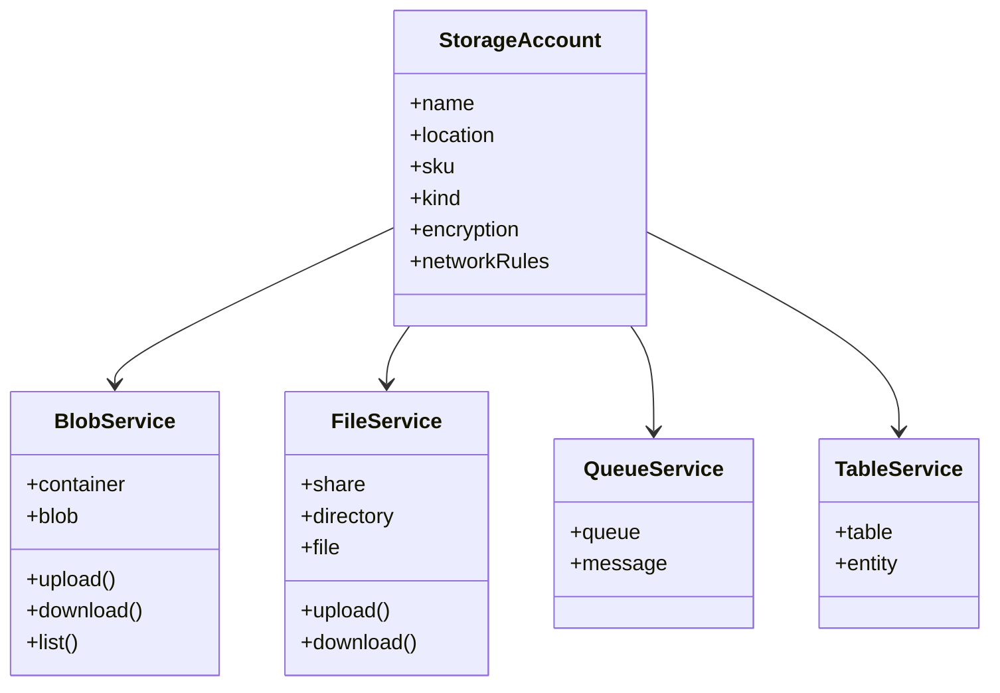

---

# 🖼️ AZURE-ONLY INFOGRAPHICS

Save these PNG files beside this Markdown file under `Lab_03_Images/`.

## Infographic 1 — Azure Storage Architecture

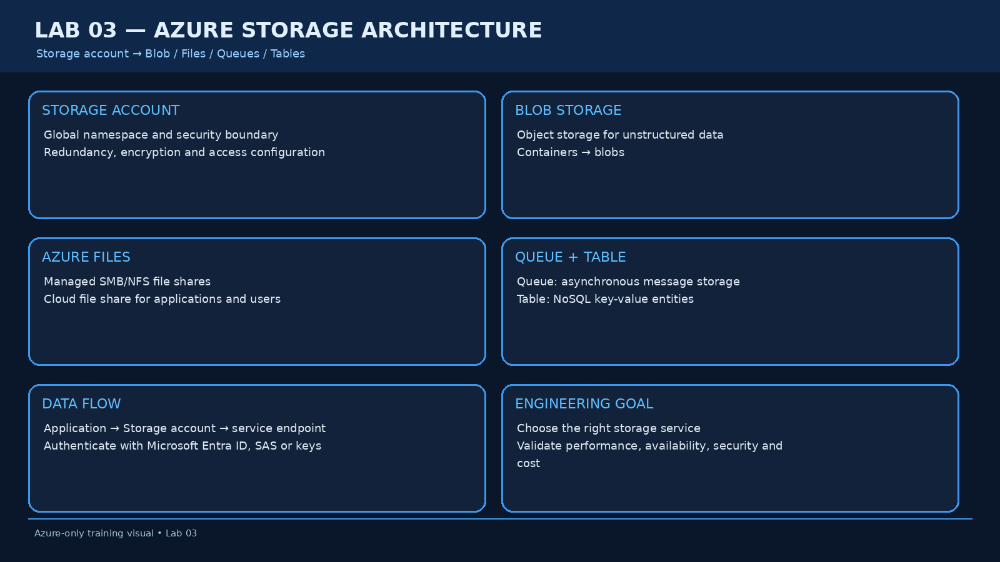

## Infographic 2 — Blob Storage Lifecycle

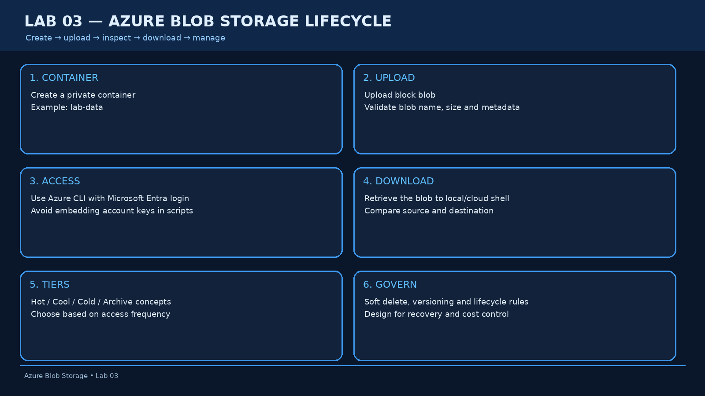

## Infographic 3 — Azure Storage Security

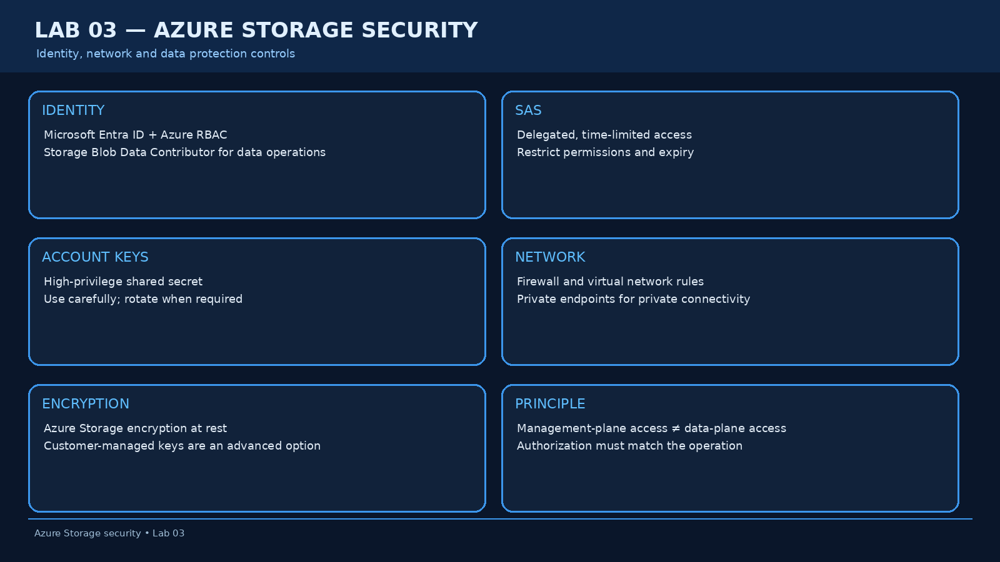

## Infographic 4 — Azure Storage Redundancy

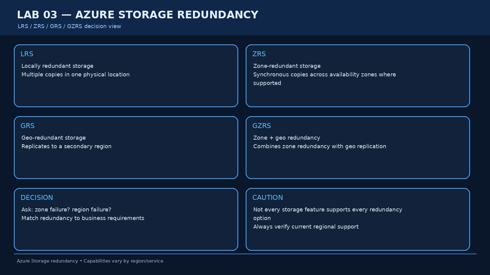

## Infographic 5 — Azure Files Architecture

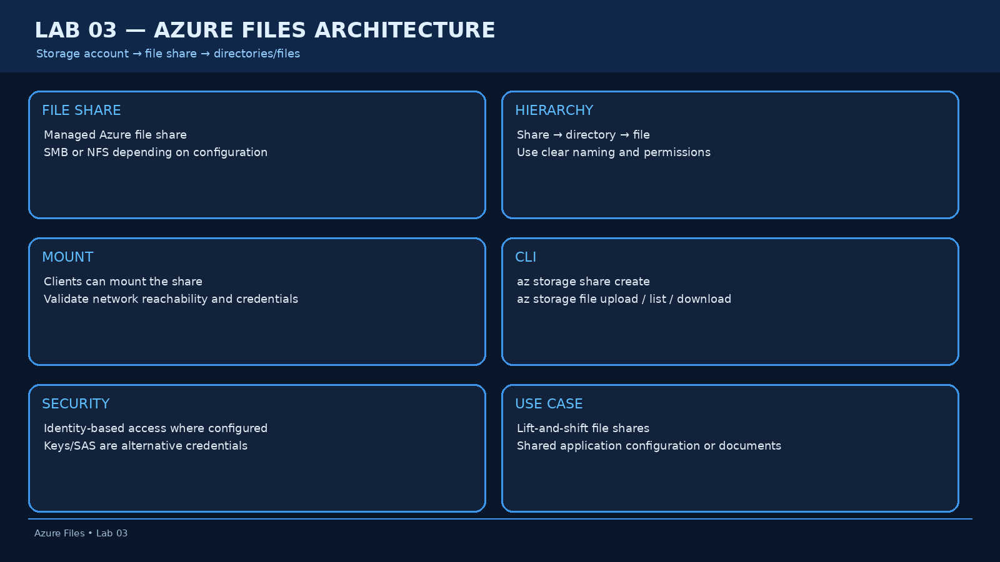

## Use Case 1 — Blob Access Denied

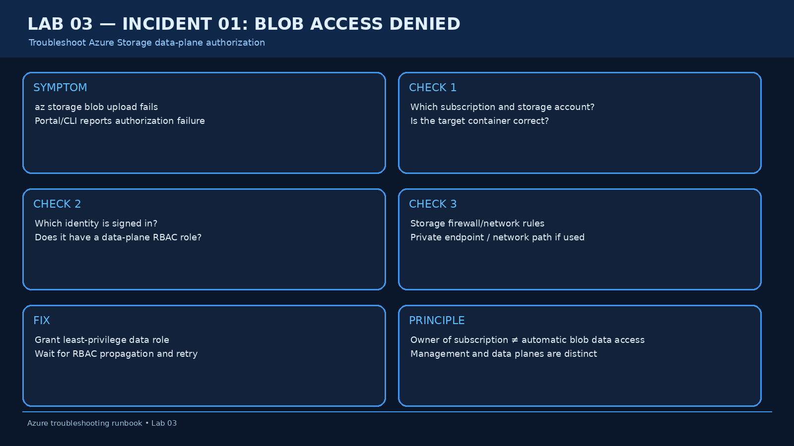

## Use Case 2 — Storage Account Unavailable

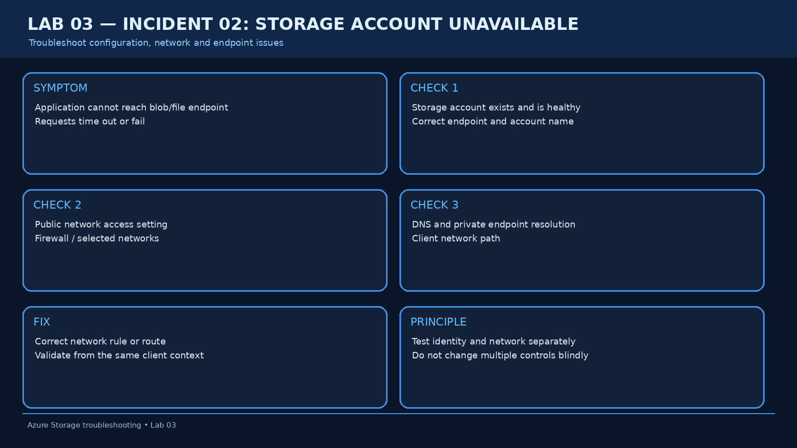

## Use Case 3 — Wrong Storage Redundancy

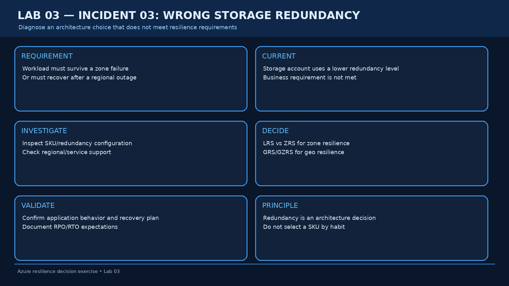

---

# PART 0 — PRE-LAB CHECKS

## Student objectives

By the end of the lab, you should be able to explain:

1. What an Azure Storage Account is.
2. The difference between Blob, Files, Queue and Table storage.
3. Management-plane vs data-plane access.
4. Why Microsoft Entra ID + Azure RBAC is preferred for many data operations.
5. When SAS or account keys may be used.
6. Why redundancy is an architecture decision.
7. How storage network restrictions can break an otherwise healthy application.

---

## Required tools

- Azure subscription
- Azure Portal
- Azure Cloud Shell
- Azure CLI
- Optional: VS Code
- Optional: GitHub Copilot

---

# PART 1 — DEFINE THE LAB ENVIRONMENT

Use:

```text
Resource Group: rg-contoso-storage
Location: <YOUR_SUPPORTED_REGION>
Storage Account: stcontosolab<unique-suffix>
Container: lab-data
File Share: contoso-share
Queue: orders
Table: inventory
```

Storage account names must be globally unique and follow Azure naming requirements.

### Engineering naming principle

```text
rg-contoso-storage
stcontosolabxxxx
```

Do not hard-code a name that may already exist.

---

# PART 2 — AZURE PORTAL: CREATE THE STORAGE ACCOUNT

## Portal click path

```text
Azure Portal
→ Storage accounts
→ Create
→ Subscription
→ Resource group
→ Storage account name
→ Region
→ Performance
→ Redundancy
→ Review
→ Create
```

### Recommended training configuration

For a cost-conscious training lab, use a suitable Standard storage configuration available in your region.

Do not blindly copy a production SKU into a student subscription.

---

# PART 3 — AZURE CLI: CREATE THE RESOURCE GROUP

```bash
az login

az account show

az group create \
  --name rg-contoso-storage \
  --location <REGION> \
  --tags \
    Environment=Training \
    Application=ContosoRetail \
    Owner=CloudEngineering \
    ManagedBy=Student
```

Validate:

```bash
az group show \
  --name rg-contoso-storage
```

---

# PART 4 — AZURE CLI: CREATE THE STORAGE ACCOUNT

```bash
az storage account create \
  --name <STORAGE_ACCOUNT_NAME> \
  --resource-group rg-contoso-storage \
  --location <REGION> \
  --sku Standard_LRS \
  --kind StorageV2
```

Validate:

```bash
az storage account show \
  --name <STORAGE_ACCOUNT_NAME> \
  --resource-group rg-contoso-storage
```

Inspect selected properties:

```bash
az storage account show \
  --name <STORAGE_ACCOUNT_NAME> \
  --resource-group rg-contoso-storage \
  --query "{name:name,location:primaryLocation,sku:sku.name,kind:kind}"
```

---

# PART 5 — UNDERSTAND THE STORAGE ENDPOINTS

Run:

```bash
az storage account show \
  --name <STORAGE_ACCOUNT_NAME> \
  --resource-group rg-contoso-storage \
  --query "[primaryEndpoints,secondaryEndpoints]"
```

Expected endpoint families include:

```text
blob
queue
table
file
web
dfs
```

Not every endpoint is relevant to every account configuration.

### Instructor discussion

Ask students:

> Why does one storage account expose multiple service endpoints?

Expected answer:

> Because Azure Storage is a family of storage services. The account provides a common management and configuration boundary while exposing specialized data services.

---

# PART 6 — CREATE A BLOB CONTAINER

Create:

```bash
az storage container create \
  --account-name <STORAGE_ACCOUNT_NAME> \
  --name lab-data \
  --auth-mode login
```

List:

```bash
az storage container list \
  --account-name <STORAGE_ACCOUNT_NAME> \
  --auth-mode login \
  --output table
```

### Important authorization concept

For data-plane operations using Microsoft Entra login, the signed-in identity needs an appropriate Azure Storage data role.

A common training role is:

```text
Storage Blob Data Contributor
```

Assign it at the narrowest practical scope.

---

# PART 7 — RBAC FOR BLOB DATA

Find your signed-in user:

```bash
az ad signed-in-user show --query id -o tsv
```

Get subscription ID:

```bash
az account show --query id -o tsv
```

Create the storage-account scope:

```bash
SUBSCRIPTION_ID=$(az account show --query id -o tsv)

STORAGE_ID="/subscriptions/$SUBSCRIPTION_ID/resourceGroups/rg-contoso-storage/providers/Microsoft.Storage/storageAccounts/<STORAGE_ACCOUNT_NAME>"
```

Assign:

```bash
USER_ID=$(az ad signed-in-user show --query id -o tsv)

az role assignment create \
  --assignee "$USER_ID" \
  --role "Storage Blob Data Contributor" \
  --scope "$STORAGE_ID"
```

> Role assignments can take time to propagate.

---

# PART 8 — CREATE AND UPLOAD A BLOB

Create a test file:

```bash
echo "Contoso Retail Azure Storage Lab 03" > sample.txt
```

Upload:

```bash
az storage blob upload \
  --account-name <STORAGE_ACCOUNT_NAME> \
  --container-name lab-data \
  --name sample.txt \
  --file sample.txt \
  --auth-mode login
```

List blobs:

```bash
az storage blob list \
  --account-name <STORAGE_ACCOUNT_NAME> \
  --container-name lab-data \
  --auth-mode login \
  --output table
```

Download:

```bash
az storage blob download \
  --account-name <STORAGE_ACCOUNT_NAME> \
  --container-name lab-data \
  --name sample.txt \
  --file downloaded-sample.txt \
  --auth-mode login
```

Compare:

```bash
cat sample.txt
cat downloaded-sample.txt
```

---

# PART 9 — AZURE PORTAL: INSPECT THE BLOB

Portal:

```text
Storage accounts
→ <Storage Account>
→ Data storage
→ Containers
→ lab-data
→ sample.txt
```

Inspect:

- URL
- Properties
- Metadata
- Blob type
- Access tier
- Last modified time

### Student task

Explain the difference between:

```text
Storage Account
Container
Blob
```

### Instructor answer

```text
Storage Account
    ↓
Container
    ↓
Blob
```

The storage account is the top-level Azure Storage resource. A container organizes blobs. A blob is the individual object/data item.

---

# PART 10 — BLOB ACCESS TIERS

Discuss:

```text
Hot
Cool
Cold
Archive
```

Ask:

> Would an application log file accessed continuously be a good Archive candidate?

### Answer

No. Archive is designed for rarely accessed data and has retrieval considerations. A frequently accessed workload should use an access tier appropriate to its access pattern.

---

# PART 11 — AZURE FILES

Create a share:

```bash
az storage share create \
  --account-name <STORAGE_ACCOUNT_NAME> \
  --name contoso-share \
  --auth-mode login
```

List shares:

```bash
az storage share list \
  --account-name <STORAGE_ACCOUNT_NAME> \
  --auth-mode login \
  --output table
```

Create a local file:

```bash
echo "Contoso shared file" > shared.txt
```

Upload:

```bash
az storage file upload \
  --account-name <STORAGE_ACCOUNT_NAME> \
  --share-name contoso-share \
  --source shared.txt \
  --path shared.txt \
  --auth-mode login
```

List:

```bash
az storage file list \
  --account-name <STORAGE_ACCOUNT_NAME> \
  --share-name contoso-share \
  --auth-mode login \
  --output table
```

---

# PART 12 — QUEUE STORAGE

Explain the architecture:

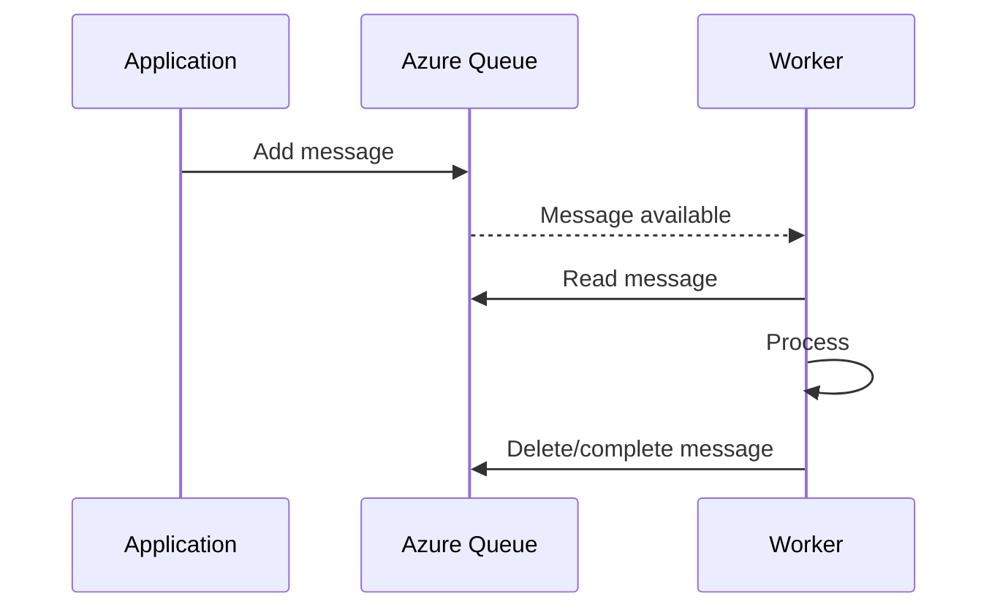

Create a queue:

```bash
az storage queue create \
  --account-name <STORAGE_ACCOUNT_NAME> \
  --name orders \
  --auth-mode login
```

Discuss:

> Why use a queue instead of directly calling another service synchronously?

Expected answer:

- decoupling
- asynchronous processing
- buffering
- resilience during temporary downstream load
- workload smoothing

---

# PART 13 — TABLE STORAGE CONCEPT

Azure Table Storage provides a NoSQL key-value/entity model.

Conceptual model:

```text
Table
 ├── PartitionKey
 ├── RowKey
 └── Properties
```

Example:

```text
Table: inventory

PartitionKey = Store01
RowKey       = Product1001
Quantity     = 25
Status       = Available
```

### Architecture discussion

Ask:

> Why is PartitionKey important?

### Instructor answer

It determines how entities are logically grouped and is important for scalability and query efficiency.

---

# PART 14 — STORAGE SECURITY

## Management plane

Examples:

```text
Create Storage Account
Change SKU
Change networking settings
Delete Storage Account
```

## Data plane

Examples:

```text
Upload Blob
Download Blob
Read File
Write Queue Message
Read Table Entity
```

### Critical interview concept

> Having permission to manage a storage account does not automatically mean the identity has the required data-plane role for blob operations.

---

# PART 15 — SAS VS ACCOUNT KEY VS ENTRA ID

| Method | Typical use |
|---|---|
| Microsoft Entra ID + RBAC | Preferred identity-based access |
| SAS | Delegated, time-limited access |
| Account key | Powerful shared secret; handle carefully |

### Student architecture decision

A web application needs to allow a customer to upload one file for 15 minutes.

Which approach is preferable?

### Answer

A tightly scoped, time-limited SAS can be appropriate because it delegates limited access without exposing the storage account key.

---

# PART 16 — STORAGE NETWORKING

Investigate:

```text
Storage Account
→ Networking
```

Discuss:

- Public network access
- Firewall rules
- Selected networks
- Private endpoints
- DNS considerations

### Troubleshooting principle

```text
IDENTITY PROBLEM
        ≠
NETWORK PROBLEM
```

A request can fail because the identity is unauthorized, or because the client cannot reach the endpoint.

---

# PART 17 — STORAGE REDUNDANCY

Compare:

```text
LRS
ZRS
GRS
GZRS
```

### Architecture decision

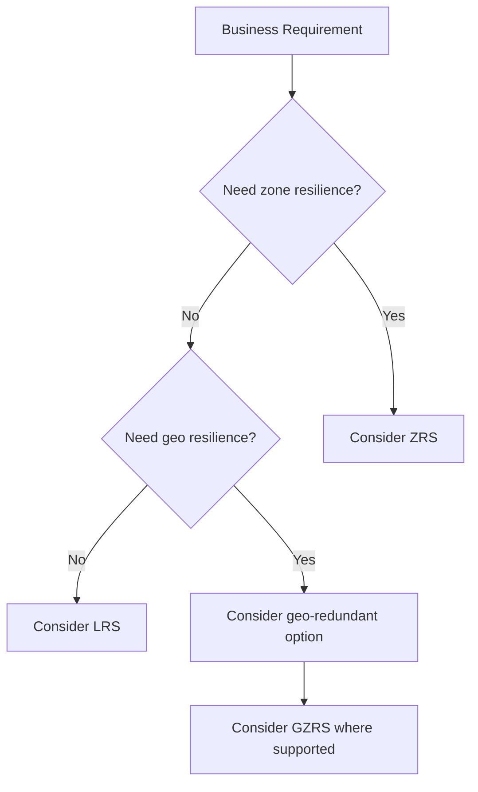

### Important

Do not teach redundancy as simply:

```text
GZRS = always best
```

Instead ask:

```text
What failure must the workload survive?
What RPO/RTO is required?
What does the region support?
What does the service support?
What does the workload cost model allow?
```

---

# PART 18 — BICEP DEPLOYMENT

Create:

`main.bicep`

```bicep
param location string = resourceGroup().location
param storageAccountName string

resource storageAccount 'Microsoft.Storage/storageAccounts@2023-05-01' = {
  name: storageAccountName
  location: location
  sku: {
    name: 'Standard_LRS'
  }
  kind: 'StorageV2'
  properties: {
    accessTier: 'Hot'
    minimumTlsVersion: 'TLS1_2'
    allowBlobPublicAccess: false
  }
}
```

Build:

```bash
az bicep build --file main.bicep
```

Validate with What-If:

```bash
az deployment group what-if \
  --resource-group rg-contoso-storage \
  --template-file main.bicep \
  --parameters storageAccountName=<STORAGE_ACCOUNT_NAME>
```

Deploy:

```bash
az deployment group create \
  --resource-group rg-contoso-storage \
  --template-file main.bicep \
  --parameters storageAccountName=<STORAGE_ACCOUNT_NAME>
```

Inspect:

```bash
az storage account show \
  --name <STORAGE_ACCOUNT_NAME> \
  --resource-group rg-contoso-storage
```

---

# PART 19 — GITHUB COPILOT ENGINEERING EXERCISE

Use GitHub Copilot as an **assistant**, not as an authority.

### Prompt 1

```text
Create a Bicep template for an Azure StorageV2 storage account.

Requirements:
- parameterize location
- parameterize storage account name
- Standard_LRS
- disable anonymous blob public access
- minimum TLS 1.2
- use clear resource naming
- include outputs for the storage account resource ID
```

### Prompt 2

```text
Review this Azure CLI storage deployment command.

Identify:
1. syntax errors
2. security risks
3. authentication assumptions
4. missing parameters
5. whether it is suitable for a training environment

Do not rewrite it until you explain the issues.
```

### Prompt 3

```text
I received an AuthorizationPermissionMismatch error while uploading a blob.

Give me a diagnostic checklist that separates:
- identity
- RBAC
- storage account configuration
- network restrictions
- container name
- authentication mode

Do not assume the root cause.
```

### Instructor rule

Students must verify Copilot output against Microsoft documentation and actual Azure behavior.

---

# PART 20 — REAL-WORLD INCIDENT 01
## 🚨 Blob Upload Returns Authorization Error


### Scenario

The developer runs:

```bash
az storage blob upload \
  --account-name <STORAGE_ACCOUNT_NAME> \
  --container-name lab-data \
  --name sample.txt \
  --file sample.txt \
  --auth-mode login
```

The command fails.

### Investigation

```bash
az account show
```

Check identity:

```bash
az ad signed-in-user show
```

Check role assignments:

```bash
az role assignment list \
  --scope "$STORAGE_ID" \
  --assignee "$USER_ID" \
  --output table
```

### Root-cause possibilities

- wrong Azure account
- wrong subscription
- missing Storage Blob Data role
- RBAC propagation delay
- wrong container
- storage network restriction

### Interview answer

> I would first establish whether the failure is management-plane or data-plane. Then I would validate the signed-in identity, storage scope, RBAC role, target container and network restrictions before changing anything.

---

# PART 21 — REAL-WORLD INCIDENT 02
## 🚨 Application Cannot Reach Storage


### Scenario

The storage account exists, but the application cannot access the blob endpoint.

### Investigation

Check account:

```bash
az storage account show \
  --name <STORAGE_ACCOUNT_NAME> \
  --resource-group rg-contoso-storage
```

Inspect network configuration:

```bash
az storage account show \
  --name <STORAGE_ACCOUNT_NAME> \
  --resource-group rg-contoso-storage \
  --query networkRuleSet
```

### Investigation sequence

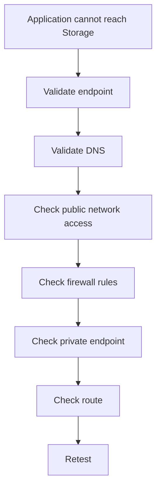

### Root-cause principle

Do not immediately change the firewall.

First prove:

```text
DNS
→ Network path
→ Storage network policy
→ Identity
→ Application configuration
```

---

# PART 22 — REAL-WORLD INCIDENT 03
## 🚨 Storage Redundancy Does Not Meet the Requirement


### Scenario

The business requirement says:

> "The application must continue operating if an availability zone fails."

The storage account uses:

```text
LRS
```

### Investigation

```bash
az storage account show \
  --name <STORAGE_ACCOUNT_NAME> \
  --resource-group rg-contoso-storage \
  --query sku.name
```

### Student question

What should you investigate before changing the SKU?

### Expected answer

- supported redundancy options in the selected region
- workload requirements
- availability-zone architecture
- RPO/RTO
- cost
- service limitations
- application recovery behavior

---

# PART 23 — TROUBLESHOOTING RUNBOOK

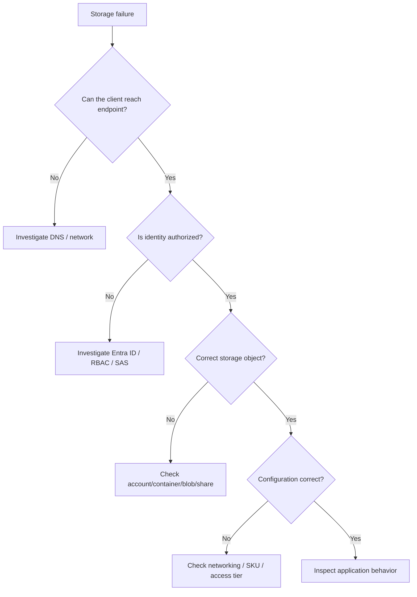

---

# PART 24 — STUDENT CHALLENGE

## Challenge A — Build a Blob Landing Zone

Create:

```text
Storage Account
└── lab-data
    ├── incoming
    ├── processed
    └── archive
```

Upload:

```text
customer.json
orders.json
inventory.json
```

Students must demonstrate:

- Portal
- CLI
- RBAC
- blob listing
- upload
- download

---

## Challenge B — Design a Secure Upload Pattern

Requirement:

> A customer must upload a file without receiving the storage account key.

Students must propose:

```text
Application
    ↓
Controlled upload authorization
    ↓
Short-lived scoped access
    ↓
Blob Container
```

Expected concept:

```text
SAS
```

with appropriate restrictions.

---

## Challenge C — Storage Failure Investigation

Instructor deliberately introduces one issue:

- wrong container
- wrong identity
- missing data role
- restrictive network rule
- incorrect account name

Student must identify the root cause without being told which one was changed.

---

# PART 25 — INTERVIEW QUESTIONS + ANSWERS

### Q1. What is an Azure Storage Account?

**Answer:** An Azure resource that provides access to storage services such as Blob, Files, Queue and Table and provides configuration boundaries for those services.

### Q2. What is Blob Storage?

**Answer:** Azure object storage for unstructured data such as documents, images, backups, logs and application objects.

### Q3. What is the difference between Blob and Azure Files?

**Answer:** Blob Storage is object storage accessed through blob APIs/endpoints, while Azure Files provides managed file shares that can be accessed using file-sharing protocols such as SMB.

### Q4. What is a container?

**Answer:** A logical grouping of blobs within Blob Storage.

### Q5. What is the difference between management-plane and data-plane access?

**Answer:** Management-plane access controls Azure resource configuration operations. Data-plane access controls operations against stored data.

### Q6. Why might an Owner still fail to upload a blob?

**Answer:** The identity may have management-plane permission but lack the required data-plane Azure Storage role.

### Q7. What is SAS?

**Answer:** A Shared Access Signature delegates limited access to storage resources using constraints such as permissions and expiration.

### Q8. Why should storage account keys be protected?

**Answer:** They provide powerful access and are shared secrets. Exposure can compromise storage resources.

### Q9. What is ZRS?

**Answer:** Zone-redundant storage replicates data synchronously across availability zones where supported.

### Q10. What is GRS?

**Answer:** Geo-redundant storage maintains replication to a secondary region.

### Q11. What is GZRS?

**Answer:** Geo-zone-redundant storage combines zone redundancy in the primary region with geo replication.

### Q12. Why isn't GZRS automatically the correct choice?

**Answer:** Architecture decisions depend on workload requirements, supported features/regions, recovery objectives and cost.

### Q13. What could cause a blob upload to fail?

**Answer:** Authentication, authorization, incorrect account/container, network restrictions, SAS expiry/permissions, or application/CLI configuration.

### Q14. How would you troubleshoot a storage timeout?

**Answer:** First validate endpoint/DNS and network reachability, then storage firewall/private endpoint configuration, then identity and application configuration.

### Q15. What is Azure Table Storage?

**Answer:** A NoSQL key-value/entity store organized around PartitionKey and RowKey.

### Q16. Why use Queue Storage?

**Answer:** To decouple producers and consumers and support asynchronous processing and workload buffering.

### Q17. What does an access tier represent?

**Answer:** A storage pricing/access pattern choice for blob data based on expected frequency of access.

### Q18. Why use Bicep for storage?

**Answer:** To define infrastructure declaratively, repeat deployments consistently and version infrastructure as code.

### Q19. What should you verify before using Copilot-generated Azure commands?

**Answer:** Syntax, current Azure CLI behavior, permissions, security implications, environment assumptions and Microsoft documentation.

### Q20. What is the first thing you check when a storage request fails?

**Answer:** Establish the failure boundary: identity/authentication, network connectivity, resource/object selection or service configuration.

---

# PART 26 — RESUME / PORTFOLIO OUTCOME

After completing this lab, a student can legitimately document experience such as:

> **Azure Storage Engineering Lab**
>
> Designed and deployed Azure Storage infrastructure using Azure Portal, Azure CLI and Bicep. Implemented Blob Storage and Azure Files, configured Microsoft Entra ID/RBAC-based data access, evaluated storage redundancy options, and troubleshot authentication, authorization and networking failures.

### Portfolio evidence

Students should commit:

```text
Lab_03/
├── README.md
├── main.bicep
├── commands.md
├── architecture/
│   ├── storage-architecture.md
│   └── troubleshooting-flow.md
├── screenshots/
└── troubleshooting/
    ├── incident-01.md
    ├── incident-02.md
    └── incident-03.md
```

---

# PART 27 — CLEANUP

Remove the lab resource group:

```bash
az group delete \
  --name rg-contoso-storage \
  --yes \
  --no-wait
```

Verify:

```bash
az group exists \
  --name rg-contoso-storage
```

Expected:

```text
false
```

> **Important:** Never execute cleanup commands against a production resource group.

---

# 🧠 FINAL LAB REVIEW

The student should now be able to explain this architecture:

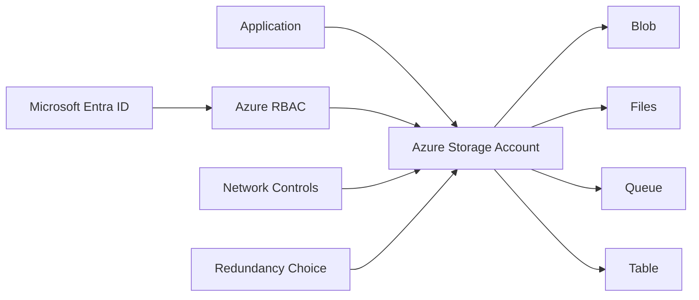

And troubleshoot using:

```text
IDENTITY
   ↓
AUTHORIZATION
   ↓
NETWORK
   ↓
RESOURCE / OBJECT
   ↓
CONFIGURATION
   ↓
APPLICATION
```

---

# 📚 OFFICIAL MICROSOFT REFERENCES

- [Create an Azure Storage Account](https://learn.microsoft.com/en-us/azure/storage/common/storage-account-create)
- [Azure Storage CLI reference](https://learn.microsoft.com/en-us/cli/azure/storage)
- [Blob Storage CLI quickstart](https://learn.microsoft.com/en-us/azure/storage/blobs/storage-quickstart-blobs-cli)
- [Azure Storage Blob CLI reference](https://learn.microsoft.com/en-us/cli/azure/storage/blob)
- [Azure Storage File CLI reference](https://learn.microsoft.com/en-us/cli/azure/storage/file)
- [Azure Storage Account Bicep reference](https://learn.microsoft.com/en-us/azure/templates/microsoft.storage/storageaccounts)
- [Azure Bicep CLI](https://learn.microsoft.com/en-us/cli/azure/bicep)
- [Microsoft Azure Storage samples](https://github.com/Azure-Samples)

Microsoft's current documentation confirms Azure CLI support for creating storage accounts, Blob operations and File Share operations, and documents Microsoft Entra-based authorization for Blob data operations. citeturn0search1turn0search3turn0search4turn0search6

---

# 🏁 INSTRUCTOR COMPLETION CHECKLIST

| Area | Completed |
|---|---|
| Storage Account | ☐ |
| Blob Container | ☐ |
| Blob Upload/Download | ☐ |
| Azure Files | ☐ |
| Queue concepts | ☐ |
| Table concepts | ☐ |
| Entra ID/RBAC | ☐ |
| SAS discussion | ☐ |
| Storage networking | ☐ |
| Redundancy | ☐ |
| Azure CLI | ☐ |
| Bicep | ☐ |
| Copilot | ☐ |
| Incident 01 | ☐ |
| Incident 02 | ☐ |
| Incident 03 | ☐ |
| Interview Questions | ☐ |
| Cleanup | ☐ |

---

## 🎓 LAB 03 COMPLETE

**You have now moved from simply creating Azure resources to engineering Azure storage that is secure, resilient, automatable and troubleshootable.**
